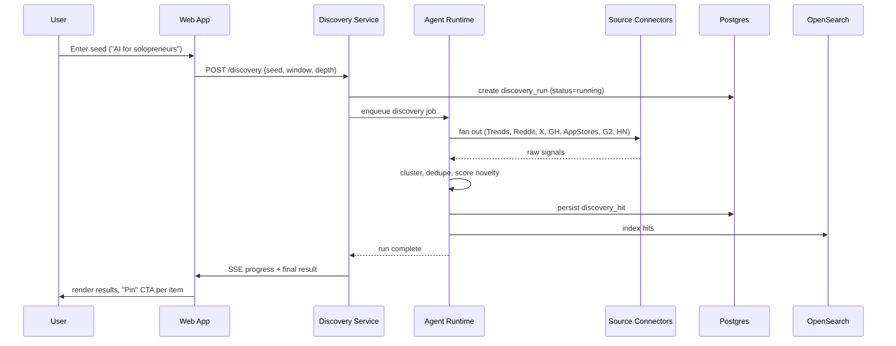
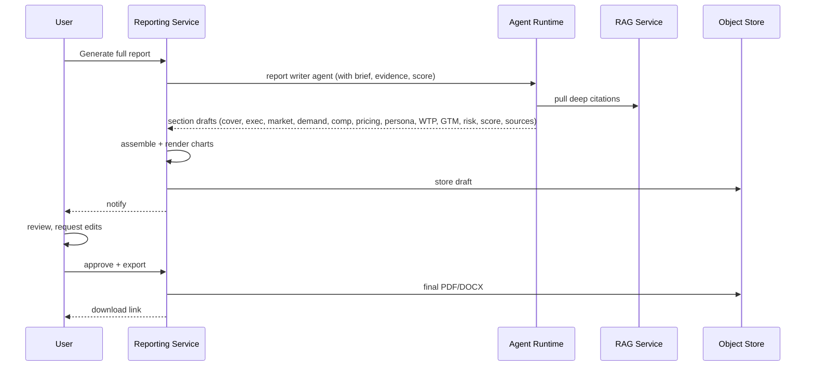
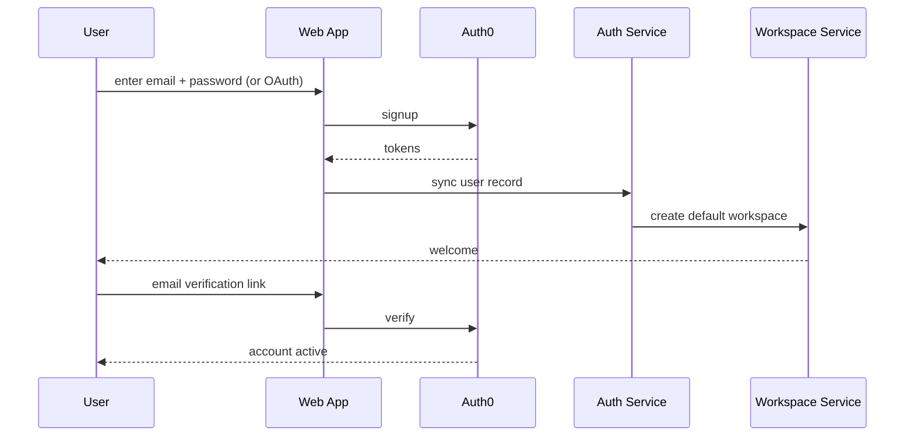
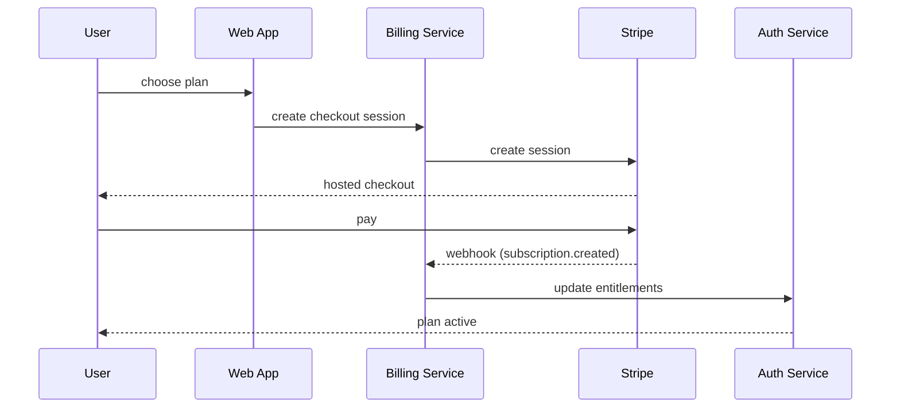

# Application Flow

> **Document 03 — VentureMiner AI**
> End-to-end user and system flows. Where the PRD states *what* and the TRD states *how*, this document traces the *paths*: who clicks what, what happens server-side, what AI agents do, and how state changes.

## Table of Contents

1. Purpose & Scope
2. Flow Notation Conventions
3. Primary User Journeys
4. Discovery Flow
5. Validation Flow
6. Scoring Flow
7. Reporting Flow
8. Authentication & Onboarding Flow
9. Billing & Subscription Flow
10. Workspace & Member Management Flow
11. Alert & Notification Flow
12. Integration Flows
13. Error & Recovery Flows
14. Admin & Compliance Flows
15. Appendix

## 1. Purpose & Scope

This document is the **map** of VentureMiner AI. It covers:

- User journeys from first touch to repeat usage.
- System flows that the user does not see but the engineering team must build.
- Failure paths and recovery.

It does not cover internal coding standards (Document 27) or component design (Document 04).

## 2. Flow Notation Conventions

- **Actor** (rectangle) — user, system, agent.
- **Decision** (diamond) — branching point.
- **Action** (rounded rectangle) — discrete step.
- **State change** (cylinder) — persistent artifact.
- **Sub-flow** (double-bordered rectangle) — referenced flow ID.
- Numbered sequences describe the canonical order; alternatives are noted explicitly.
- Sequence diagrams are written in Mermaid.

## 3. Primary User Journeys

### 3.1 First-time user → first useful artifact

1. Land on `/` (SEO page or paid ad).
2. Sign up via email or OAuth.
3. Land in onboarding (product tour).
4. Pick a "starter track":
   - **Indie Founder** → niche exploration → top trend → validation → brief.
   - **Corporate Innovator** → adjacency exploration → portfolio → board report.
   - **Investor** → thesis portfolio → deal memo.
   - **Consultant** → client report template.
5. First artifact generated in ≤ 10 minutes.

**Success metric:** AC-OB-0001-1 (first-run tour completion), AC-OB-0002-1 (sample opportunity usage), KPI: time-to-first-report (Section 11, PRD).

### 3.2 Returning user → weekly review

1. Sign in.
2. Land on dashboard with new activity in feed.
3. Review alerts: new trends, fresh evidence on watched opportunities.
4. Drill into a refreshed opportunity.
5. Update score, archive, or add to a report.

### 3.3 Power user → custom rubric + portfolio

1. Open Settings → Rubric.
2. Create new rubric "Consumer AI", define dimensions, weights.
3. Apply rubric to a portfolio of 20 opportunities.
4. Re-rank; export comparison report.
5. Subscribe to weekly digest on this portfolio.

## 4. Discovery Flow

### 4.1 Trigger

- **Manual:** user clicks "Run Discovery" on a saved search or seed.
- **Scheduled:** user-defined cron (Daily/Weekly).
- **Continuous:** always-on mode for Team+ (post-MVP).

### 4.2 Sequence (manual)



### 4.3 Acceptance criteria

- AC-DISC-0001-1: ≥ 20 hits returned for a non-niche seed.
- AC-DISC-0007-1: No duplicate hits across sources.
- AC-DISC-0009-1: Each hit lists its sources.
- AC-DISC-0008-1: Time window is respected.

### 4.4 Failure modes

- **Source timeout** → marked as `partial`; user notified; run continues.
- **Source error rate > 50%** → run aborted, user prompted to disable source.
- **LLM error** → retried with fallback model; final failure surfaces in audit.

## 5. Validation Flow

### 5.1 Trigger

- User clicks "Validate" on a discovery hit or saved opportunity.
- User selects depth: **Quick** (1 source/claim, < 60s), **Standard** (3 sources, 3–8 min), **Deep** (5+ sources, 8–30 min).

### 5.2 Sequence (Standard)

```mermaid
sequenceDiagram
  participant U as User
  participant W as Web App
  participant VP as Validation Pipeline
  participant AR as Agent Runtime
  participant RS as Research Agents
  participant RAG as RAG Service
  participant SC as Scoring Service
  participant DB as Postgres

  U->>W: Validate opportunity (Standard)
  W->>VP: POST /validation {opp_id, depth=standard}
  VP->>DB: create validation_run
  VP->>AR: orchestrate(plan)
  loop per dimension (market, demand, comp, pricing, persona, WTP, GTM, risk)
    AR->>RS: spawn specialist agent
    RS->>RAG: retrieve relevant corpus
    RAG-->>RS: top-k chunks + citations
    RS-->>AR: structured findings w/ citations
    AR->>VP: append to validation_step
  end
  AR->>SC: compute scores (uses current rubric)
  SC-->>VP: score + breakdown
  VP->>DB: persist run
  VP-->>W: SSE progress + final
  W->>U: render findings + scores; "Generate Report" CTA
```

### 5.3 Acceptance criteria

- AC-VAL-0001-1..AC-VAL-0010-1: each dimension's panel rendered.
- AC-VAL-0011-1: depth shown to user; time estimate matches run time ±20%.
- AC-VAL-0013-1: user can attach manual evidence.

### 5.4 Failure modes

- **Agent hallucination detected by verifier** → re-run with explicit prompts; if fails twice, mark dimension as `unverified`.
- **RAG retrieval empty** → degrade gracefully, surface warning, allow user to attach manual evidence.
- **Run aborted** → partial findings persisted, run marked `partial`, user can resume.

## 6. Scoring Flow

### 6.1 Default rubric (v1.0)

| Dimension | Weight |
|---|---|
| Market size | 20% |
| Growth | 15% |
| Demand | 20% |
| Buildability | 15% |
| Defensibility | 15% |
| AI-fit | 15% |

### 6.2 Sequence

1. Validation run produces evidence (per Section 5).
2. Scoring Service receives evidence and current rubric.
3. For each dimension, an LLM judge produces:
   - Sub-score 0–10.
   - Rationale (1–3 sentences).
   - Confidence (low/med/high).
4. Final score = Σ weight × sub-score.
5. Stored with full breakdown for audit.

### 6.3 Custom rubric flow (Team+)

1. User opens Rubric editor.
2. Adds / edits / reorders dimensions and weights (must sum to 100).
3. Saves → new rubric version.
4. Re-scores current portfolio (or selected opportunities).
5. User can view history; scores from old versions remain visible.

### 6.4 Acceptance criteria

- AC-SCORE-0001-1: default rubric exists.
- AC-SCORE-0002-1: user can add/weight dimensions.
- AC-SCORE-0004-1: each change creates a new version.
- AC-SCORE-0005-1: each dimension score shows rationale + evidence.
- AC-SCORE-0008-1: portfolio view sortable by score.

## 7. Reporting Flow

### 7.1 One-page brief

- Trigger: "Generate brief" on an opportunity.
- Output: 1-page PDF.
- Generation: < 60s p75.
- Format: 6 fixed sections (see PRD §7.5).

### 7.2 Full report (Standard)



### 7.3 Comparison report

- Trigger: select ≥ 2 opportunities → "Compare".
- Output: side-by-side table + 1-page narrative per opportunity.
- Generation: < 3 min p75.

### 7.4 Acceptance criteria

- AC-RPT-0001-1: brief < 60s p75.
- AC-RPT-0002-1: full report 10–25 pages.
- AC-RPT-0004-1: comparison report 1–2 per opportunity + comparison matrix.
- AC-RPT-0006-1: PDF, DOCX, MD, HTML exports.
- AC-RPT-0010-1: every claim is footnoted.

## 8. Authentication & Onboarding Flow

### 8.1 Sign up



### 8.2 Sign in

- Email + password (Auth0).
- OAuth (Google, GitHub, Microsoft).
- Magic link (post-MVP).
- MFA challenge (TOTP) for users who enrolled.
- Enterprise SSO via SAML / OIDC (Document 21 for detail).

### 8.3 Onboarding checklist

- AC-OB-0010-1: tracks 5 actions (sign up, complete tour, run first discovery, run first validation, generate first report).

## 9. Billing & Subscription Flow

### 9.1 Sign up → Free tier

- Default on signup.

### 9.2 Upgrade



### 9.3 Downgrade / cancel

- Self-serve; pro-rated credit issued per Stripe settings.

### 9.4 Enterprise contract

- Sales-led; contract executes via Stripe sales motion.
- Custom legal (MSA, DPA) attached to workspace.

### 9.5 Acceptance criteria

- AC-BIL-0005-1: Stripe-backed checkout.
- AC-BIL-0008-1: pro-rated upgrade/downgrade.
- AC-BIL-0009-1: tax computed.

## 10. Workspace & Member Management Flow

### 10.1 Create workspace

- Trigger: "New workspace" (Solo: disabled; Team: 25; Enterprise: unlimited).

### 10.2 Invite member

1. Owner/Admin enters email + role.
2. Invite email sent (Postmark).
3. Recipient clicks link → sign in (or sign up) → added to workspace.

### 10.3 Role change

- Owner/Admin can change role.
- Only Owner can transfer ownership.

### 10.4 Acceptance criteria

- AC-AUTH-0007-1: roles gate write actions.
- AC-AUTH-0008-1: users can belong to multiple workspaces.
- AC-AUTH-0009-1: every role change is logged.

## 11. Alert & Notification Flow

### 11.1 Alert types

- New trend matched watchlist.
- New evidence on watched opportunity.
- Score change beyond threshold.
- Validation run completed.
- Report ready.
- Member joined/left workspace.
- Billing event (card expiring, payment failed).

### 11.2 Delivery channels

- In-app notification center.
- Email.
- Slack (per workspace).
- Webhook (post-MVP).

### 11.3 Acceptance criteria

- AC-DASH-0004-1: user can configure alert rules.
- AC-INT-0005-1: alerts delivered to Slack.

## 12. Integration Flows

### 12.1 Slack

- OAuth install per workspace.
- User picks channel for each alert type.
- Outbound via Slack Web API.

### 12.2 Notion

- OAuth install; user picks database.
- Opportunity pushed on transition; report pushed on generation.

### 12.3 REST API

- User mints a token in Settings.
- Scoped token: `opportunity:read`, `opportunity:write`, `report:read`, etc.
- Rate-limited per workspace tier.

### 12.4 Acceptance criteria

- AC-INT-0001-1: OpenAPI 3.1 spec published.
- AC-INT-0009-1: scoped tokens.
- AC-INT-0010-1: tier-based rate limits.

## 13. Error & Recovery Flows

### 13.1 LLM run failure

- Detection: error event from agent runtime.
- Action: retry with backoff; fallback model on second failure; surface to user.
- User action: rerun, contact support, or attach manual evidence.

### 13.2 Payment failure

- Stripe webhook → billing service → notify user.
- After 3 retries, downgrade to Free at end of period.

### 13.3 Data export / deletion

- AC-PLAT-0007-1: idempotency keys on writes.
- AC-ADMIN-0008-1: configurable retention.
- AC-ADMIN-0010-1: self-serve DPA download.

## 14. Admin & Compliance Flows

### 14.1 Audit log

- Every write action logged with actor, resource, before/after.
- Filterable, exportable (Enterprise).

### 14.2 DPA / compliance

- Enterprise admin downloads DPA, SOC 2 report, sub-processor list from admin panel.

### 14.3 SCIM

- IdP pushes users/groups → auth-svc reconciles → entitlements applied.

## 15. Appendix

### 15.1 Flow ID index

| ID | Flow |
|---|---|
| F-DISC-1 | Discovery — manual |
| F-DISC-2 | Discovery — scheduled |
| F-VAL-1 | Validation — Quick |
| F-VAL-2 | Validation — Standard |
| F-VAL-3 | Validation — Deep |
| F-SCORE-1 | Default scoring |
| F-SCORE-2 | Custom rubric scoring |
| F-RPT-1 | One-page brief |
| F-RPT-2 | Full report |
| F-RPT-3 | Comparison report |
| F-AUTH-1 | Sign up |
| F-AUTH-2 | Sign in |
| F-BILL-1 | Upgrade |
| F-BILL-2 | Cancel |
| F-WS-1 | Create workspace |
| F-WS-2 | Invite member |
| F-NOT-1 | Alert config |
| F-INT-1 | Slack install |
| F-INT-2 | Notion install |
| F-INT-3 | API token mint |

### 15.2 Revision history

| Version | Date | Author | Summary |
|---|---|---|---|
| v0.5 | 2026-07-20 | Doc Team | All flows drafted |
| v1.0 | 2026-07-20 | Doc Team | First approved version |

---

> *End of Document 03 — Application Flow. Detailed screen flows are in Document 04 (UI/UX).*
