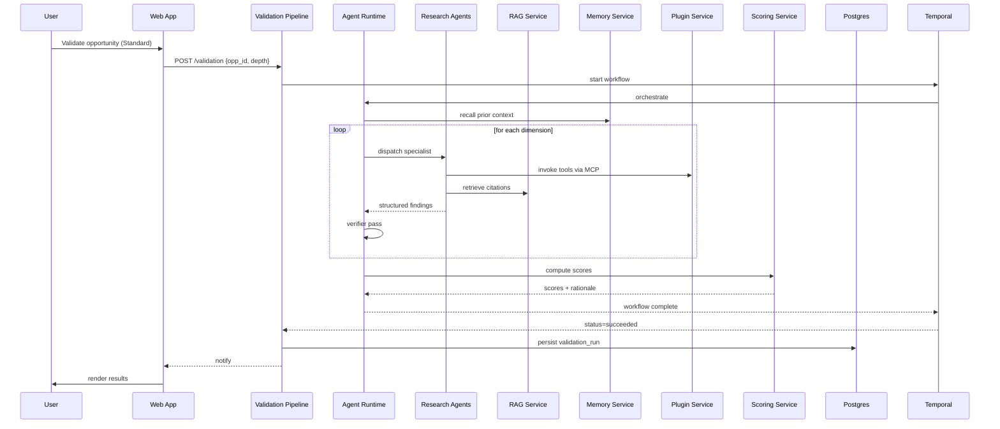

# Document 07 — System Architecture

> The end-to-end system view. Where the TRD and Backend docs cover the OLTP plane, this document covers the **AI plane** and how it integrates with the rest. This is the entry point for anyone trying to understand "how does VentureMiner AI actually work?"

## Table of Contents

1. Purpose & Scope
2. The Three Planes
3. System Context
4. Container View
5. Component View
6. Sequence: end-to-end user request
7. AI Plane
8. Data Flows
9. Cross-cutting Concerns
10. Decision Log
11. Appendix

## 1. Purpose & Scope

This document is the system-level map. It identifies the planes, the major components, the interconnections, and the data flows. It does not detail the internals of any single component — those are in the per-component documents (08–18).

## 2. The Three Planes

VentureMiner AI's architecture is organized into three planes:

- **OLTP plane** — user-facing services, auth, billing, persistence. Document 05.
- **AI plane** — agent runtime, RAG, memory, MCP, plugins, models. Documents 08–14.
- **Async plane** — Temporal workflows, NATS JetStream, scheduled jobs. Documents 05 and 15.

These planes share the platform plane (observability, secrets, identity) but otherwise evolve independently.

## 3. System Context

```
                         VentureMiner AI System Context
┌────────────────────────────────────────────────────────────────┐
│                                                                │
│  Users                  Integrations         Internal           │
│  ─────                  ────────────         ────────           │
│  Indie founder  ───┐    Slack       ┌────  AI agents          │
│  Corp innovator  ──┤    Notion      │     Models             │
│  Investor        ──┼──► Web App ───┤     Plugins            │
│  Consultant      ──┘    API       │     RAG corpus         │
│                              │    │     Memory store       │
│                              │    └──────────────────────   │
│                              ▼                                │
│                      VentureMiner AI                          │
│                              │                                │
│                              ▼                                │
│                       Source APIs                             │
│                       (X, Reddit, GH, AppStores, G2, ...)      │
│                       LLM Providers                           │
│                       (Anthropic, OpenAI)                     │
└────────────────────────────────────────────────────────────────┘
```

## 4. Container View

The system is composed of the following containers (deployable units):

| Container | Plane | Tech | Purpose |
|---|---|---|---|
| `web` | Edge | Next.js | User UI, BFF |
| `api-public` | OLTP | FastAPI | Public REST API |
| `api-bff` | OLTP | Node | Internal BFF for web |
| `auth-svc` | OLTP | Python | Auth, RBAC, SSO |
| `workspace-svc` | OLTP | Python | Workspaces, members |
| `opportunity-svc` | OLTP | Python | Opportunities |
| `discovery-svc` | OLTP | Python | Orchestrates discovery runs |
| `validation-pipeline` | OLTP | Python | Orchestrates validation runs |
| `scoring-svc` | OLTP | Python | Rubric, scoring |
| `reporting-svc` | OLTP | Python | Reports |
| `agent-runtime` | AI | Python (LangGraph) | Hosts agents, MCP gateway |
| `rag-svc` | AI | Python | RAG retrieval, indexing |
| `memory-svc` | AI | Python | Long-term memory |
| `plugin-svc` | AI | Python | Plugin registry, runtime |
| `source-svc` | AI | Python | Source connectors |
| `temporal-worker` | Async | Temporal | Workflow execution |
| `nats` | Async | NATS | Event bus |
| `postgres` | OLTP | PG 16 | OLTP + vector |
| `redis` | OLTP | Redis 7 | Cache, sessions |
| `opensearch` | OLTP | OS 2 | Search |
| `object-store` | Both | S3/R2 | Artifacts |

## 5. Component View

Within the AI plane, components are organized as:

```
agent-runtime
├── orchestrator         (root, plan + dispatch)
├── research agents      (specialists)
├── scoring agent
├── report writer agent
├── mcp gateway          (uniform tool surface)
├── verifier agent       (citation + consistency check)
└── safety filter        (PII redaction, policy guard)
   │
   ├──► rag-svc         (retrieve / index)
   ├──► memory-svc      (read / write)
   ├──► plugin-svc      (invoke tools)
   └──► source-svc      (call external APIs)
```

## 6. Sequence: end-to-end user request

The most representative flow: a user runs **Validation (Standard depth)** on an opportunity.



## 7. AI Plane

### 7.1 Agent runtime

- Built on **LangGraph** (Python) for graph-based agent orchestration.
- **State** is a typed object (`ValidationState`, `DiscoveryState`, ...) that flows through nodes.
- Each node is a pure async function with retries and timeout.
- **Orchestrator** plans a sequence of specialist calls; **specialists** do focused work; **verifier** audits the work for citation + consistency; **safety filter** redacts PII and enforces policy.

### 7.2 Models

- **Default model:** Anthropic Claude Sonnet 4.5 for routine work; Opus 4 for high-stakes synthesis (board reports).
- **Fallback:** OpenAI GPT-4o for tool failures.
- **Self-host (v2):** Llama 3.1 405B on dedicated GPUs for cost control.
- Model selection is **per call** based on a routing function that considers:
  - Required quality (rubric weight).
  - Latency budget.
  - Cost budget.
  - Provider health.

### 7.3 Tools

- All tools are exposed via **MCP** (Document 12).
- Tool manifest is per-agent; the orchestrator cannot directly call any tool without going through MCP.
- Tools have:
  - A JSON Schema input.
  - A versioned manifest (`name`, `version`, `risk_level`).
  - Rate limits.
  - Cost tracking.

### 7.4 RAG

- Document 10.

### 7.5 Memory

- Document 11.

### 7.6 Plugins

- Document 13.

## 8. Data Flows

### 8.1 At a glance

- **User → Web → API → Service → AI plane → Service → Web → User.** Read-heavy flows use OpenSearch; write flows use Postgres + outbox.
- **AI plane → external:** plugin-mediated (via MCP gateway).
- **External sources → AI plane:** source connectors; never reach the OLTP plane directly.

### 8.2 PII handling

- PII is redacted at the AI plane boundary; prompts and logs never contain raw PII.
- LLM calls are tagged with a `pii_risk` field; high-risk calls require an additional review.

### 8.3 Cost attribution

- Every AI call carries a cost record (model, tokens, tools, duration).
- Aggregated per workspace per day; surfaced in the admin dashboard.

## 9. Cross-cutting Concerns

- **Identity** — every AI plane call carries an OIDC token; authz is enforced at MCP.
- **Secrets** — model API keys in AWS Secrets Manager; LLM providers called via proxy with rotated keys.
- **Tenancy** — workspace_id is part of every call context; RAG and memory are scoped.
- **Observability** — OpenTelemetry traces span OLTP and AI planes; tool calls, model calls, and verifier decisions are all spans.
- **Policy** — a central policy service enforces content and data-handling rules.

## 10. Decision Log

| ID | Decision | Rationale |
|---|---|---|
| AD-001 | Use LangGraph for agent orchestration | Better control than LangChain agents; native async + state |
| AD-002 | MCP for tool surface | Vendor-neutral; future-proof |
| AD-003 | pgvector v1 → Qdrant v2 | Operational simplicity first |
| AD-004 | Per-call model routing | Cost vs. quality balance |
| AD-005 | No cross-service 2PC | Outbox + idempotency is simpler and safer |
| AD-006 | Workspace-scoped RAG | Avoid cross-tenant leakage; support per-tenant corpus |

## 11. Appendix

### 11.1 Glossary

| Term | Definition |
|---|---|
| AI plane | The set of services that host agents, RAG, memory, and MCP |
| Orchestrator | The top-level agent that plans a multi-step run |
| Specialist | An agent focused on a narrow task (e.g. market sizing) |
| Verifier | An agent that audits another agent's output |

### 11.2 Revision history

| Version | Date | Author | Summary |
|---|---|---|---|
| v0.5 | 2026-07-20 | Doc Team | All sections drafted |
| v1.0 | 2026-07-20 | Doc Team | First approved version |

### 11.3 Cross-references

- TRD: Document 02.
- Backend: Document 05.
- Multi-Agent: Document 08.
- Agent Specs: Document 09.
- RAG: Document 10.
- Memory: Document 11.
- MCP: Document 12.
- Plugins: Document 13.
- Discovery: Document 14.
- Research Pipeline: Document 15.
- Scoring Engine: Document 16.
- Report Generation: Document 17.

---

> *End of Document 07 — System Architecture. The container, component, and sequence views here are referenced by every other AI architecture document.*
