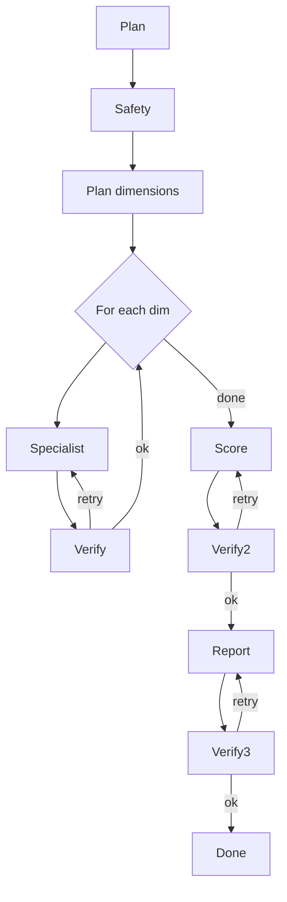

# Document 08 — Multi-Agent Architecture

> How the agents collaborate. The roles, the state machine, the protocol between them, and the failure handling.

## Table of Contents

1. Purpose & Scope
2. Why multi-agent
3. Agent roles
4. Orchestration graph
5. State model
6. Communication protocol
7. Conflict resolution
8. Failure handling
9. Cost & latency budget
10. Testing multi-agent runs
11. Appendix

## 1. Purpose & Scope

This document is the multi-agent architectural contract. It defines the agents, how they talk, what they remember, and how they fail. The per-agent contracts are in Document 09.

## 2. Why multi-agent

A single monolithic LLM prompt cannot:

- Plan a multi-step research process.
- Recall the right evidence at the right time.
- Verify its own claims.
- Refuse policy-violating requests.
- Stay within cost/latency budgets.

We split the work into specialized agents so each can:

- Have a **focused system prompt** (less noise, better accuracy).
- Use a **focused tool set** (less risk, less cost).
- Be **tested in isolation** (deterministic, fast).
- Be **swapped** (e.g. replace one researcher's prompt without retraining everything).

## 3. Agent roles

| ID | Name | Role |
|---|---|---|
| AGT-ORCH | Orchestrator | Plans a run, dispatches specialists, manages state |
| AGT-DISC-PLANNER | Discovery planner | Designs a discovery run (sources, queries) |
| AGT-DISC-CLUSTER | Discovery clusterer | Groups hits into candidate opportunities |
| AGT-RSRCH-MARKET | Research — market | Estimates TAM/SAM/SOM, growth |
| AGT-RSRCH-DEMAND | Research — demand | Aggregates search/social/intent |
| AGT-RSRCH-COMP | Research — competitive | Builds competitive map |
| AGT-RSRCH-PRICING | Research — pricing | Collects competitor pricing |
| AGT-RSRCH-PERSONA | Research — persona | Synthesizes buyer personas |
| AGT-RSRCH-WTP | Research — WTP | Estimates willingness to pay |
| AGT-RSRCH-GTM | Research — GTM | Diagnoses go-to-market channels |
| AGT-RSRCH-RISK | Research — risk | Identifies and weighs risks |
| AGT-SCORE | Scoring | Computes scores from evidence and rubric |
| AGT-RPT-WRITER | Report writer | Assembles long-form reports |
| AGT-VERIFY | Verifier | Audits claims for citation + consistency |
| AGT-SAFETY | Safety filter | Redacts PII, enforces policy |
| AGT-PLANNER | Generic planner | Generates plans for novel sub-tasks |
| AGT-CRITIC | Critic | Reviews and suggests revisions |

The role names use the format `AGT-<DOMAIN>-<NAME>`, with domain-specific where useful.

## 4. Orchestration graph

The discovery → validation → scoring → report pipeline is a single graph per user request. The orchestrator owns the graph; specialists are nodes.



### 4.1 Sub-graphs

Each specialist node is itself a small graph:

```
plan → retrieve (RAG) → fetch (plugin) → synthesize → self-check
```

A specialist can:

- Ask for clarification (rare; only if input is genuinely ambiguous).
- Emit a sub-plan for the orchestrator to acknowledge.
- Fail loudly with a structured error.

## 5. State model

A `RunState` is a typed object passed between nodes:

```python
class RunState(BaseModel):
    run_id: UUID
    workspace_id: UUID
    user_id: UUID
    goal: str
    plan: Plan
    evidence: list[Evidence]
    scratchpad: dict
    budget: Budget              # tokens, tools, time
    history: list[Step]         # append-only
    outputs: dict
```

- `evidence` is the only authoritative store; specialists append to it.
- `scratchpad` is ephemeral; not persisted.
- `history` is append-only and replayable.
- `budget` is enforced by the orchestrator; over-budget calls fail.

## 6. Communication protocol

- **Synchronous:** in-process calls within a single agent.
- **Asynchronous:** between agents in different processes, via NATS subjects:
  - `agent.run.requested`
  - `agent.run.progress`
  - `agent.run.completed`
  - `agent.run.failed`
- **Event envelope:** CloudEvents v1.0.
- **Schema registry:** all agent I/O is versioned.

## 7. Conflict resolution

When two agents disagree (e.g. market size estimates differ):

1. Both findings are stored with full provenance.
2. The verifier surfaces the conflict.
3. The orchestrator requests an additional pass with a tie-breaker.
4. If still conflicting, the user is asked to disambiguate (rare).

## 8. Failure handling

| Failure | Detection | Response |
|---|---|---|
| Agent timeout | Per-step timeout | Retry with backoff; mark step failed |
| Agent error | Exception | Capture; verifier proposes corrective plan |
| Verifier rejects twice | 2x rejection | Mark dimension unverified; user prompt |
| Cost budget exceeded | Budget guard | Stop run; surface partial result |
| Tool failure | Plugin error | Retry; fallback tool; surface in report |
| LLM provider down | Provider health | Switch provider; if both down, abort |
| Schema violation | Validation | Reject; log; surface |

## 9. Cost & latency budget

| Run type | Token budget | Wall-clock budget |
|---|---|---|
| Discovery (Standard) | 250k | 90s |
| Validation (Quick) | 50k | 30s |
| Validation (Standard) | 400k | 8 min |
| Validation (Deep) | 1.2M | 30 min |
| One-page brief | 80k | 60s |
| Full report | 1M | 8 min |
| Comparison report | 600k | 3 min |

The orchestrator monitors these budgets and degrades gracefully (skips a dimension, switches to a faster model) when the budget is at risk.

## 10. Testing multi-agent runs

- **Unit:** each specialist in isolation, with a recorded input fixture.
- **Integration:** mini-graph (2–3 agents) with a mock orchestrator.
- **End-to-end:** full graph on a recorded real-world scenario.
- **Replay:** production traces can be replayed with new code to compare.
- **Adversarial:** injected tool failures, model errors, and policy violations.
- **Calibration:** monthly run of a fixed scenario set; regression in accuracy > 2% blocks release.

## 11. Appendix

### 11.1 Agent ID conventions

- `AGT-ORCH` — orchestrator.
- `AGT-RSRCH-<DOMAIN>` — research specialist.
- `AGT-SCORE` — scoring.
- `AGT-RPT-WRITER` — report.
- `AGT-VERIFY` — verifier.
- `AGT-SAFETY` — safety.

### 11.2 Revision history

| Version | Date | Author | Summary |
|---|---|---|---|
| v0.5 | 2026-07-20 | Doc Team | All sections drafted |
| v1.0 | 2026-07-20 | Doc Team | First approved version |

### 11.3 Cross-references

- System Architecture: Document 07.
- Agent Specs: Document 09.

---

> *End of Document 08 — Multi-Agent Architecture. Per-agent specifications live in Document 09.*
