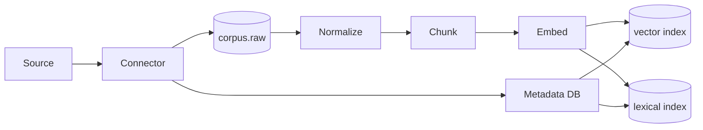

# Document 10 — RAG Architecture

> Retrieval-Augmented Generation (RAG) is the **only path** by which an agent can ground a claim in external knowledge. This document defines the corpus, the index, the retrieval pipeline, the citation model, and the evaluation framework.

## Table of Contents

1. Purpose & Scope
2. Why RAG (and only RAG)
3. Corpus
4. Ingestion pipeline
5. Chunking
6. Embeddings
7. Index (vector + lexical)
8. Retrieval pipeline
9. Re-ranking
10. Citation model
11. Freshness
12. Quality evaluation
13. Per-tenant corpus
14. Cost & scale
15. Failure modes
16. Appendix

## 1. Purpose & Scope

This document is the RAG architectural contract. It governs the corpus, the index, the retrieval, and the citation discipline that all agents depend on.

## 2. Why RAG (and only RAG)

- **Grounded claims.** The model cannot invent a number if it must cite a chunk.
- **Freshness.** Sources can be re-fetched without retraining.
- **Tenant isolation.** Each workspace has its own corpus slice.
- **Auditability.** A citation is a link to a chunk that links to a source URL.

We forbid direct LLM knowledge claims for any quantitative or time-sensitive fact. Anything not in the corpus must be marked as "inferred" and reviewed by the verifier.

## 3. Corpus

### 3.1 Composition

The corpus is composed of:

- **Public web** — fetched on demand for known sources; cached in the corpus.
- **Source API** — Reddit, X, GitHub, AppStores, G2, HN, etc. — pushed via source connectors.
- **Internal documents** — workspace-uploaded PDFs, docs, sheets.
- **Knowledge packs** — curated sets (industry reports, market data) per vertical.

### 3.2 Lifecycle

- **Capture:** source connector fetches → write to `corpus.raw`.
- **Normalize:** clean, dedupe, extract text + metadata.
- **Chunk:** split into retrieval units (Section 5).
- **Embed:** generate embeddings (Section 6).
- **Index:** upsert to vector + lexical indexes (Section 7).
- **Serve:** retrieve on demand (Section 8).

## 4. Ingestion pipeline



- Backpressure: if embedding queue depth > N, pause ingest; surface backpressure metric.
- Replay: every step is idempotent; ingestion is replayable from `corpus.raw`.

## 5. Chunking

- **Default chunker:** recursive character with overlap.
- **Chunk size:** 800 tokens target, 1200 max, 200 min.
- **Overlap:** 200 tokens.
- **Structure-aware chunker** for HTML, Markdown, and PDF (preserves headings).
- **Code-aware chunker** for code (function boundaries).
- **Tables:** preserved as Markdown tables within a chunk.

## 6. Embeddings

- **Default model:** `text-embedding-3-large` (3072 dims) for v1.
- **v2 candidate:** a self-hosted BGE-M3 for cost.
- **Normalization:** L2-normalized; cosine similarity.
- **Metadata:** source URL, fetch timestamp, freshness class, language, document type.

## 7. Index

### 7.1 Vector index

- **Storage:** pgvector (v1), Qdrant (v2).
- **Index type:** HNSW (m=16, ef_construction=64), recast to ivfflat if rows < 100k.
- **Sharding:** by tenant (workspace).

### 7.2 Lexical index

- **Engine:** OpenSearch 2.x with BM25.
- **Sharding:** by tenant.

### 7.3 Hybrid retrieval

- Combine vector + lexical scores using reciprocal rank fusion (RRF, k=60).
- Boost documents by freshness and by source weight (configurable per source).

## 8. Retrieval pipeline

```
query → embed → ANN (vector) + BM25 (lexical) → RRF fuse → top 50 → rerank → top 10 → return
```

- **Top-10 default**; configurable per agent.
- **Query rewriting** for multi-turn: include prior turn context into a single query string.

## 9. Re-ranking

- **Reranker model:** `bge-reranker-v2-m3` or Cohere Rerank 3.
- **Goal:** push the most relevant chunk to position 1.
- **Cost:** reranker calls are the second-largest variable cost after LLM synthesis.

## 10. Citation model

Every claim produced by an agent is bound to:

- A `chunk_id` (which contains a `source_url` and `fetched_at`).
- A `confidence` (high/med/low).
- A `freshness_class` (live, recent, stale, unknown).

The agent's output must include, for every claim:

```json
{ "claim": "...", "citation": { "chunk_id": "...", "source_url": "...", "fetched_at": "...", "confidence": "high" } }
```

The verifier audits the citation; ungrounded claims are rejected.

## 11. Freshness

- **Live:** fetched within the last 24h.
- **Recent:** 1–7d.
- **Stale:** 7–30d.
- **Unknown:** > 30d or no timestamp.

Agents MUST mark time-sensitive claims with a freshness class. The report surfaces freshness per section.

## 12. Quality evaluation

### 12.1 Metrics

- **Recall@10** — does the chunk containing the answer appear in the top 10?
- **Citation precision** — what fraction of cited chunks are actually relevant?
- **Citation recall** — what fraction of claims have a citation?
- **Freshness accuracy** — does the marked freshness match the source's actual age?

### 12.2 Eval set

- 500 hand-labeled queries across verticals, refreshed quarterly.
- Regressions > 2% block release.

## 13. Per-tenant corpus

- Each workspace has its own collection (`RC-<workspace_id>`).
- Tenant isolation enforced at index time (shard key) and at query time (filter).
- Cross-tenant retrieval is impossible by design.

## 14. Cost & scale

| Operation | v1 cost (per 1M ops) |
|---|---|
| Embedding | $80 |
| Vector query | $0.10 (pgvector on db.r6g.2xlarge) |
| Reranker call | $20 |
| Index build | $5 / M chunks |

Targets:

- 100M chunks in corpus at Year 1.
- p95 retrieval latency < 300ms.

## 15. Failure modes

| Failure | Response |
|---|---|
| Embedding provider down | Fallback to second provider; if both down, fail RAG call and surface "no evidence". |
| pgvector index corrupt | Rebuild from `corpus.chunk` (idempotent). |
| OpenSearch unhealthy | Degrade lexical; serve vector only. |
| Reranker down | Skip rerank; cap top-k lower. |
| Stale corpus | Schedule re-fetch; freshness flag updates. |

## 16. Appendix

### 16.1 Glossary

| Term | Definition |
|---|---|
| Chunk | A retrieval unit (target 800 tokens) |
| RRF | Reciprocal rank fusion — combined ranking across indexes |
| Freshness | How recent the source is at retrieval time |
| Citation precision | Fraction of citations that point to a relevant chunk |

### 16.2 Revision history

| Version | Date | Author | Summary |
|---|---|---|---|
| v0.5 | 2026-07-20 | Doc Team | All sections drafted |
| v1.0 | 2026-07-20 | Doc Team | First approved version |

### 16.3 Cross-references

- Multi-Agent: Document 08.
- Agent Specs: Document 09.
- Memory: Document 11.
- MCP: Document 12.
- Plugin Architecture: Document 13.

---

> *End of Document 10 — RAG Architecture. The citation discipline here is the foundation of every report and every score.*
