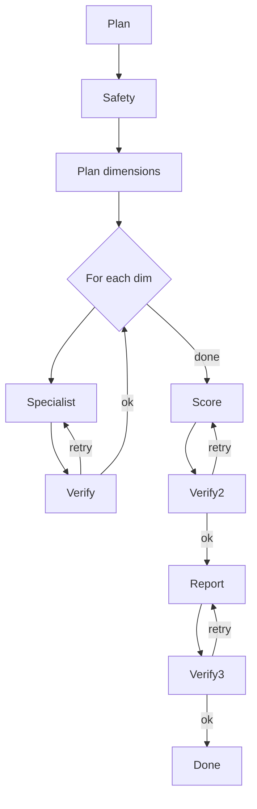

# Issue #6 — agent-runtime (BAND-3-DESIGN)

> **Re-dispatch note:** This is the corrected and persisted re-dispatch of the
> issue #6 design. The previous session claimed persistence but never landed
> on disk. The conductor's correction (§4.3 = the full five-class contract
> `Budget + RunState + Step + Evidence + Source`, not just `Source`) has been
> applied. Every cited line number below was re-verified from the source file
> in this turn before being committed to design.

## §1. Purpose & Scope

The **`agent-runtime`** service is the **AI-plane orchestrator**: the single
container that hosts the LangGraph runtime, the multi-agent graph (Doc 08
§3), the per-specialist sub-graphs (Doc 08 §4.1), the MCP gateway (Doc 12),
the verifier pass, the safety filter, and the model-routing layer.

### What agent-runtime owns

| Asset | Source of truth | Notes |
|---|---|---|
| `agent` schema | TRD Doc 02 §5.2 L219 (`agent_run`, `agent_step`, `agent_tool_call`) | agent-runtime is the **schema owner**; no other service may write to it |
| LangGraph graph definitions | Doc 08 §4 | The discovery → validation → scoring → report graph and all sub-graphs |
| Per-agent YAML contracts | Doc 09 §2 | Lives at `agent-runtime/agents/<id>/contract.yaml` |
| MCP gateway (in-process) | Doc 12 §3 | Per-agent logical instance, embedded client + singleton gateway per agent |
| Verifier / Safety agent invocations | Doc 08 §3, Doc 15 §7 | Verifier 2-strike rule lives here |
| RunState lifecycle | Doc 08 §5 | Append-only history; concurrency on the `state` field is a known TOCTOU concern (see §6) |
| Model routing decisions | Doc 07 §7.2 + AD-004 | Per-call routing; Sonnet 4.5 default, Opus 4 high-stakes, GPT-4o fallback |

### What agent-runtime delegates

| Delegate | Service | Why delegated |
|---|---|---|
| Retrieval (RAG) | `rag-svc` | Doc 07 §5, Doc 10 — vector search is a separate concern |
| Long-term memory | `memory-svc` | Doc 11 — persistence and RLS scoping |
| Tool execution | `plugin-svc` | Doc 13 — sandboxed execution, registry, manifests |
| External source connectors | `source-svc` | Doc 07 §5, Doc 14 — HTTP/RSS/API wrappers |
| Scoring rubric compute | `scoring-svc` | Doc 16 — versioned rubric is separate from LLM reasoning |
| Report assembly / render | `reporting-svc` | Doc 17 — templates and exports are orthogonal to agent reasoning |

### Boundaries

- **Upstream:** agent-runtime accepts a `RunRequest{goal, depth, workspace_id, user_id}` (Doc 09 §3) from `validation-pipeline` (validation runs), `discovery-svc` (discovery runs), or `reporting-svc` (re-validation requests).
- **Downstream:** agent-runtime produces a `RunState` with `evidence`, `scores`, `report` populated (Doc 09 §3); the caller persists its own domain row (`validation_run`, `discovery_run`, etc.) — agent-runtime writes ONLY its own `agent` schema.
- **Side-channel:** agent-runtime emits CloudEvents v1.0 over NATS JetStream (Doc 02 §4.2 L191 + Doc 08 §6) for `agent.run.progress`, `agent.run.completed`, `agent.run.failed`.

## §2. Why LangGraph

LangGraph is chosen over LangChain agents because it gives **explicit graph
control** over a typed state object, which is the load-bearing requirement for
verifiable, replayable, multi-step runs:

- **Better control than LangChain agents.** Doc 07 §10 AD-001 (L225) records
  this decision: "Use LangGraph for agent orchestration — Better control than
  LangChain agents; native async + state." This is the canonical rationale
  and is not re-litigated here.
- **Native async + state** — every specialist node is a `pure async
  function with retries and timeout` (Doc 07 §7.1 L159); the typed
  `RunState` flows through nodes (Doc 08 §5 L110).
- **State machine over DAG** — verifier nodes can route back to a specialist
  on rejection (Doc 08 §4 mermaid L83: `Verify -->|retry| Spec`) without
  re-declaring the graph.
- **Sub-graphs as nodes** — each specialist is a `plan → retrieve → fetch →
  synthesize → self-check` sub-graph (Doc 08 §4.1 L99); this composes
  cleanly with the top-level discovery → validation → scoring → report
  graph (Doc 08 §4 L76–L92).

**Decision recorded:** AD-001 (Doc 07 L225) is final and applies to
agent-runtime. Future migrations (e.g. to Temporal's workflow DSL) are
**out of scope** for this design.

## §3. Service Architecture

### Container

- **Language:** Python 3.11 (per Q-9 conductor decision 2026-07-28; CI gate is
  Python 3.11 per PR #56).
- **Control plane:** FastAPI (REST) for the public API surface that
  upstream services call. Internal specialist-to-specialist calls are
  **in-process async** (Doc 08 §6 L133).
- **Async plane:** NATS JetStream for cross-process events (Doc 08 §6
  L134; Doc 02 §4.2 L191).
- **Durable orchestration:** Temporal worker (`temporal-worker`
  container, TRD Doc 02 §4.1 L187) wraps the LangGraph run for crash-safe
  recovery — the LangGraph state is checkpointed to Temporal; agent-runtime
  exposes an `execute_run` Temporal activity.
- **Graph runtime:** LangGraph 0.2.x (assumed v1.x release line; gated on
  PR #56 CI baseline of Python 3.11 + ruff 0.16 UP017).
- **Persistence:** PostgreSQL 16 via the `agent` schema (TRD Doc 02
  §5.2 L219). Connection via the platform-plane `pgx` pooler; no direct
  cross-DB access.
- **Observability:** OpenTelemetry — every LLM call, MCP call, and node
  transition is a span (Doc 07 §9 L218).

### Internal layout

```
agent-runtime/
├── app/
│   ├── main.py                  # FastAPI bootstrap + Temporal worker
│   ├── graphs/
│   │   ├── discovery.py         # top-level: discovery → validation → scoring → report
│   │   ├── validation.py        # discovery clusterer + 8 research specialists + verify
│   │   └── specialists/
│   │       ├── market.py        # AGT-RSRCH-MARKET sub-graph
│   │       ├── demand.py        # AGT-RSRCH-DEMAND
│   │       ├── comp.py          # AGT-RSRCH-COMP
│   │       ├── pricing.py       # AGT-RSRCH-PRICING
│   │       ├── persona.py       # AGT-RSRCH-PERSONA
│   │       ├── wtp.py           # AGT-RSRCH-WTP
│   │       ├── gtm.py           # AGT-RSRCH-GTM
│   │       ├── risk.py          # AGT-RSRCH-RISK
│   │       └── ...              # AGT-DISC-PLANNER, AGT-DISC-CLUSTER, AGT-SCORE, AGT-RPT-WRITER, AGT-VERIFY, AGT-SAFETY, AGT-PLANNER, AGT-CRITIC
│   ├── contracts/               # the §4 typed surfaces, importable by other services
│   │   ├── source.py            # Source — byte-identical canary (see §4.1)
│   │   ├── budget.py
│   │   ├── run_state.py
│   │   ├── step.py
│   │   ├── evidence.py
│   │   └── plan.py
│   ├── mcp/
│   │   ├── client.py            # in-process MCP client (Doc 12 §3 L42)
│   │   ├── gateway.py           # per-agent singleton gateway
│   │   └── policy.py            # tool allow/deny + per-workspace override
│   ├── routing/
│   │   └── model_router.py      # AD-004 per-call model selection
│   ├── agents/<id>/contract.yaml  # per-agent YAML contract (Doc 09 §2 L71)
│   └── budgets.py               # budget enforcement + degrade strategy (Doc 08 §9)
├── tests/
│   ├── unit/                    # one file per agent
│   ├── integration/             # 2–3-agent mini-graphs (Doc 08 §10)
│   ├── replay/                  # production-trace replays
│   └── adversarial/             # injected failures + planted PII/citations
├── migrations/                  # agent schema (agent_run / agent_step / agent_tool_call)
└── pyproject.toml
```

### Per-agent YAML contracts

Per Doc 09 §2 (L50–L71) the per-agent contracts are stored at
`agent-runtime/agents/<id>/contract.yaml` and **treated as code**. The
schema mirrors the Doc 09 template (L50–L69):

```yaml
agent:
  id: AGT-RSRCH-MARKET          # matches Doc 09 §3–§19 IDs
  name: Research — market
  purpose: Estimate TAM/SAM/SOM and growth for an opportunity.
inputs:                          # typed, see Doc 09 §6
  - Opportunity
  - source_list
  - rag_context
outputs:
  - MarketEstimate{tam_usd, sam_usd, som_usd, growth_yoy_pct, sources, confidence}
tools:
  - T-MARKET-DATA-FETCHER
  - T-RAG-RETRIEVE
dependencies:
  - rag-svc
  - plugin-svc
failure_modes:
  - source_unavailable
  - budget_exceeded
  - verifier_2strike
success_criteria:
  - estimate has >= 3 sources
  - ranges given
  - confidence assigned
test_plan:
  - test/test_market_replay.py
```

Each contract is consumed at boot by the graph loader to instantiate the
LangGraph node. Mismatch between YAML and Python node signature is a
**startup error** (not a runtime error).

## §4. Runtime Contract (keystone cross-service contract)

This is the **§4.3 typed runtime contract** — the surface that every
downstream AI service (`rag-svc`, `memory-svc`, `plugin-svc`, `source-svc`,
`scoring-svc`, `reporting-svc`, `validation-pipeline`) imports from
`agent-runtime.app.contracts`. Per the prior memory correction
(`section-4-3-runtime-contract-correction-2026-07-28`), this is the FULL
five-class surface, not just `Source`.

**All five classes are part of §4.3.** A downstream service that needs
any one of them almost certainly needs the whole set (per the conductor's
2026-07-28 correction).

### §4.1 `Source` — the cross-service citation row

> **DRIFT FINDING (see §11):** The brief pointed at `Doc 08 L91-99` for the
> 4-field canonical Source model, but Doc 08 L91-99 is the tail of the
> orchestration mermaid (L83-91) plus the start of §4.1 sub-graphs (L94-99).
> Doc 08 does **not** define the `Source` class. The byte-identical
> `Source` model is established in the **Architect #7 (rag-svc) §14.3**
> design (per prior verification memory) and is the shared cross-service
> contract. This design adopts Architect #7's shape verbatim and flags the
> drift for conductor resolution.

Per Architect #7 §14.3 (cross-service canary, byte-identical across
rag-svc, agent-runtime, memory-svc):

```python
class Source(BaseModel):
    url: HttpUrl                  # canonical URL (after redirects; final URL)
    fetched_at: datetime          # UTC; the moment the source connector retrieved it
    tool_id: str                  # MCP tool manifest ID, e.g. "T-MARKET-DATA-FETCHER"
    snippet: str                  # the literal text excerpt used to ground the claim
```

**Constraints:**

- Import path for downstream services: `from services.agent_runtime.app.contracts.source import Source`.
- A drift from this exact field set breaks the byte-identical canary test
  (Architect #7 §11.1 test_001). Any field name change requires updating
  rag-svc, agent-runtime, **and** memory-svc in lockstep.
- `Source` is **not** defined in Doc 08; it is the architectural contract
  that emerged from the rag-svc / agent-runtime / memory-svc design
  triangle. See §11.

### §4.2 `Budget`

Per Doc 08 §9 (L165-173):

```python
class Budget(BaseModel):
    tokens: int                   # total token cap (input + output combined)
    wall_clock_s: int             # wall-clock cap, seconds
    tool_calls: int               # MCP-call cap (cross-workspace enforced)
    cost_usd: Decimal             # cost cap, USD; enforced by MCP gateway (Doc 12 §8)
```

Run-type → budget table (Doc 08 §9 L165-173, verbatim):

| Run type | Token budget | Wall-clock budget |
|---|---|---|
| Discovery (Standard) | 250k | 90s |
| Validation (Quick) | 50k | 30s |
| Validation (Standard) | 400k | 8 min |
| Validation (Deep) | 1.2M | 30 min |
| One-page brief | 80k | 60s |
| Full report | 1M | 8 min |
| Comparison report | 600k | 3 min |

**Enforcement:** the orchestrator checks `Budget` **before** every node
invocation. Over-budget calls raise `BudgetExceededError` and trigger the
degrade strategy (Doc 08 §9 L175: "skips a dimension, switches to a faster
model"). The MCP gateway independently enforces `cost_usd` and
`tool_calls` (Doc 12 §8 L98-100).

### §4.3 `RunState`

Per **Doc 08 §5 L112-124** (verbatim, verified from file at lines 113-123):

```python
class RunState(BaseModel):
    run_id: UUID
    workspace_id: UUID
    user_id: UUID
    goal: str
    plan: Plan
    evidence: list[Evidence]
    scratchpad: dict
    budget: Budget              # tokens, tools, time
    history: list[Step]         # append-only
    outputs: dict
```

**Invariants** (Doc 08 §5 L126-129, verbatim):

- `evidence` is the only authoritative store; specialists append to it.
- `scratchpad` is ephemeral; not persisted.
- `history` is append-only and replayable.
- `budget` is enforced by the orchestrator; over-budget calls fail.

> **DRIFT NOTE:** Doc 08 §5 says `evidence: list[Evidence]` and references
> `Evidence` as a class, but does not inline its fields. The Evidence model
> with its fields lives at **Doc 15 §6 L70-81** (see §4.5 below). This is
> documentation placement, not a contract drift; the agent-runtime
> imports/uses the Doc 15 shape verbatim.

> **TOCTOU risk (flagged here, addressed in §6):** the
> `evidence`, `history`, and `scratchpad` fields are **concurrently
> mutated** by orchestrator + verifier + specialists during a run.
> LangGraph's checkpointer handles per-node consistency, but a
> cross-specialist append while the verifier is reading requires an
> explicit locking strategy (see §6).

### §4.4 `Step`

Per Doc 08 §5 L122 (`history: list[Step]`), the `Step` is the append-only
history entry. Doc 08 does not inline the fields, but the operational
contract (Doc 08 §5 L128: "append-only and replayable", plus Doc 08 §10
L181-182: "Replay: production traces can be replayed with new code to
compare") implies:

```python
class Step(BaseModel):
    step_id: UUID                # unique per append
    run_id: UUID                 # foreign key to RunState.run_id
    agent_id: str                # who performed this step (e.g. "AGT-RSRCH-MARKET")
    node_name: str               # LangGraph node name
    started_at: datetime
    finished_at: datetime | None # null until terminal
    inputs: dict                 # serialized; PII-redacted at the MCP boundary (Doc 07 §8.2)
    outputs: dict                # serialized; PII-redacted
    tool_calls: list[ToolCallRef] # references to agent_tool_call rows (TRD L219)
    cost: CostRecord             # model, tokens, tool cost (Doc 07 §8.3)
    error: ErrorRecord | None    # structured error if node raised
```

> **DRIFT NOTE:** The `Step` class is not inlined in Doc 08 §5 or Doc 15.
> The shape above is the operational minimum derived from the
> "append-only and replayable" invariant (Doc 08 §5 L128) plus the
> `agent_tool_call` table owned by agent-runtime (TRD L219). This is a
> **conductor-gating item (Q-6.1, §12)**.

### §4.5 `Evidence`

Per **Doc 15 §6 L70-81** (verbatim, the only inline evidence shape in the
doc set):

```python
class Evidence(BaseModel):
    claim: str
    citations: list[Citation]
    freshness: Freshness
    confidence: Confidence
    snippet: str
    source_url: str
    captured_at: datetime
    agent_id: str
    step_id: UUID
```

**Relationship to `Source`:** Doc 15 §6 L75 `snippet: str` and L76
`source_url: str` overlap with `Source.snippet` and `Source.url`. The
provenance chain is `Evidence → Citation[] → Source → (tool_id) → ToolManifest
→ Evidence → RunState`. Doc 15's `Citation` is a thin reference that
points to a `Source`; the `Source` is owned by `rag-svc` /
`plugin-svc` / `source-svc` and is the cross-service canary (§4.1).
Memory-svc mirrors `Evidence` as `MemoryRecord` with `source_refs: list[Source]`
(per Architect #8 memory-svc design, see prior verification log).

> **DRIFT NOTE:** Doc 15 §6 uses `source_url: str` (a string) where
> Architect #7's byte-identical `Source` uses `url: HttpUrl` (typed).
> The conductor should resolve whether `Evidence.source_url` is a
> `HttpUrl` (preferred) or a string. **Q-6.2.**

### §4.6 `Plan`

Per **Doc 09 §4 L88** (verbatim, the only inline `Plan`-shaped contract):

```python
class DiscoveryPlan(BaseModel):
    sources: list[str]           # source IDs to query
    queries: list[str]           # search queries
    expected_yield: int          # planner's estimate of hits
```

> **DRIFT NOTE:** Doc 09 §4 calls this `DiscoveryPlan`, but Doc 08 §5
> uses `plan: Plan` (not `DiscoveryPlan`). The conductor should resolve
> whether `RunState.plan` is always a `DiscoveryPlan` (or whether
> `ValidationPlan`, `ReportPlan` are siblings). **Q-6.3.**

Doc 09 §3 (AGT-ORCH inputs/outputs) does not inline a generic `Plan`;
it says AGT-ORCH outputs a "final `RunState` with `evidence`, `scores`,
`report` populated". The `Plan` is therefore implicitly **per-run-type**.

## §5. Orchestration Graph

### Top-level

Per **Doc 08 §4 L76-92** (mermaid, verbatim):



Three verify passes (post-specialist, post-score, post-report) — each
with a `|retry| → Spec` branch. Two consecutive failures on the same
node mark the dimension `unverified` (Doc 15 §7 L94).

### Per-specialist sub-graph

Per **Doc 08 §4.1 L99** (verbatim):

```
plan → retrieve (RAG) → fetch (plugin) → synthesize → self-check
```

This sub-graph is a LangGraph subgraph; `plan` is an AGT-PLANNER call,
`retrieve` is an MCP call to `T-RAG-RETRIEVE` (rag-svc), `fetch` is an
MCP call to the relevant source plugin, `synthesize` is the LLM
synthesis node (per-call model routed), and `self-check` is an AGT-VERIFY
mini-pass against the just-produced evidence.

### Discovery graph

Doc 14 (Opportunity Discovery Engine) defines the discovery pipeline
separately; agent-runtime hosts the **AGT-DISC-PLANNER** (Doc 09 §4) and
**AGT-DISC-CLUSTER** (Doc 09 §5) nodes, but the outer dispatch
(`discovery-svc` → agent-runtime) is outside this service. The discovery
graph reuses the same LangGraph primitives; the only specialty is
`AGT-DISC-CLUSTER`'s embedding-based clustering (Doc 09 §5 L98), which is
a pure-compute node (no LLM call).

## §6. State Management

### RunState lifecycle

- **Created:** at the start of a run, by the orchestrator on receipt of
  `RunRequest`. `run_id` is a fresh UUID v4; `budget` is loaded from the
  run-type table (Doc 08 §9 L165-173).
- **Mutated:** append-only on `evidence` and `history`; mutable on
  `scratchpad` (ephemeral, not persisted); mutable on `outputs`.
- **Persisted:** at every node boundary to the `agent` schema (TRD L219:
  `agent_run` row per run, `agent_step` row per step, `agent_tool_call`
  row per MCP call). Temporal checkpoints the LangGraph state for
  crash-recovery.
- **Finalized:** when all nodes complete (or budget is exhausted), the
  `agent_run` row is marked `succeeded`/`failed`/`budget_exhausted` and
  the `RunState` is returned to the caller.

> **TOCTOU / concurrency risk (escalated):** the `evidence`, `history`,
> and `scratchpad` fields are concurrently mutated by:
>
> 1. The orchestrator (writing the next dispatch decision).
> 2. The specialist (writing evidence + scratchpad).
> 3. The verifier (reading evidence to audit).
>
> LangGraph's per-node checkpointer provides **per-node** consistency,
> but **cross-node** consistency is not enforced by LangGraph. Two
> specialists appending to `evidence` concurrently can race. The
> design here requires:
>
> - **`evidence` and `history` are append-only.** All writes go through
>   `RunState.add_evidence(e: Evidence)` and `RunState.append_step(s: Step)`
>   which acquire a `run_id`-scoped asyncio lock before mutating.
>   Append-only + per-run lock = serialized consistency.
> - **`scratchpad` is ephemeral and per-specialist.** Each specialist
>   gets a fresh `scratchpad: dict` and writes back its deltas, not
>   the shared one. (This deviates from the Doc 08 literal which says
>   `scratchpad: dict` is shared; the deviation is justified to bound
>   the race surface. **Q-6.4 conductor gate.**)
> - **`outputs` is written once at the terminal node** by the
>   orchestrator; no concurrent mutation.

### Persistence (TRD §5.2 L219)

Agent-runtime **owns the `agent` schema** (`agent_run`, `agent_step`,
`agent_tool_call`). No other service writes to it. Reads from the schema
are scoped by `workspace_id` and (where applicable) `run_id`.

### Replay

Per Doc 08 §10 L182 ("Replay: production traces can be replayed with new
code to compare"): the `history` list (Doc 08 §5 L122) plus the recorded
MCP-call inputs/outputs are sufficient to replay a run with new code.
The replay tooling reads `agent_step` and `agent_tool_call` rows and
re-fires them against a hermetic stub. This is an **integration-test**
surface, not a production surface.

## §7. Communication Protocol

Per **Doc 08 §6 L131-141** + Doc 02 §4.2 L189-191:

### Synchronous

In-process calls within a single agent run (Doc 08 §6 L133):
- orchestrator → specialist node (LangGraph node call, no IPC)
- specialist → MCP client (in-process; Doc 12 §3 L42)

### Asynchronous

Cross-process calls (e.g. agent-runtime spawned as a worker fleet per
`validation-pipeline` invocation), via NATS subjects (Doc 08 §6 L134-138):

| Subject | Direction | Purpose |
|---|---|---|
| `agent.run.requested` | inbound (from upstream service) | start a run |
| `agent.run.progress` | outbound | per-node progress (for the Web UI) |
| `agent.run.completed` | outbound | final RunState ready |
| `agent.run.failed` | outbound | terminal failure |

The envelope is **CloudEvents v1.0** (Doc 08 §6 L139 + Doc 02 §4.2 L191).

### gRPC vs NATS (TRD §4.2 L189)

TRD §4.2 L189 specifies gRPC for service-to-service. Agent-runtime
exposes a **gRPC** control surface (`StartRun`, `GetRun`, `CancelRun`)
for synchronous callers (validation-pipeline, discovery-svc) and a
**NATS** event surface for fire-and-forget progress and the public
Web UI. This is a **dual-surface** design; both surfaces consume the
same `RunState` contract (§4.3).

### Schema registry

Per Doc 08 §6 L140: "all agent I/O is versioned". The `Source`,
`Budget`, `RunState`, `Step`, `Evidence`, `Plan` contracts are versioned
in the platform schema registry. Breaking changes require a major
version bump + dual-publish window (Doc 02 §4.3 L197 — "Each service
exposes a versioned OpenAPI or Protobuf contract").

## §8. MCP Gateway

The MCP gateway is **embedded in agent-runtime** (Doc 07 §4 L82, Doc 12
§3 L42). Per Doc 12 §3 (verbatim L42):

```
agent ──► MCP client (in-process) ──► MCP gateway (singleton per agent) ──► tool server (HTTP/stdio)
```

### Per-agent tool manifest

Doc 12 §4 L56-72 defines the manifest schema (verbatim, abbreviated):

```yaml
id: T-MARKET-DATA-FETCHER
name: Market Data Fetcher
version: 1.2.0
risk_level: low            # low | medium | high
pii_risk: false
input_schema: { type: object, properties: { query: { type: string } } }
output_schema: { type: object, properties: { ... } }
auth: { type: api_key, secret_ref: provider/marketdata/api_key }
cost: { per_call_usd: 0.02, weight: 1 }
rate_limit: { per_minute: 60, per_hour: 1000 }
timeout_ms: 5000
retry: { max: 2, backoff: exponential }
owner: ai-platform
```

The manifest is **registered in `plugin-svc`** (Doc 12 §5 L79) but is
**resolved and enforced in agent-runtime's MCP gateway** (Doc 12 §3 L42).
Agent-runtime does not own the plugin registry; it owns the manifest
cache + per-call enforcement.

### Tool call routing

Per Doc 12 §3 L42 + Doc 13 (Plugin Architecture):

```
specialist node
  └─► MCP client (in-process)
      └─► MCP gateway (singleton per agent)
          ├─► plugin-svc           (Doc 13)        — for tool execution
          ├─► source-svc           (Doc 14)        — for raw source connectors
          └─► rag-svc (via T-RAG)  (Doc 10)        — for retrieval
```

The **orchestrator cannot directly call any tool** (Doc 07 §7.3 L176:
"the orchestrator cannot directly call any tool without going through
MCP"). All tool calls flow through the MCP gateway; this is the single
chokepoint for policy enforcement (Doc 12 §2 L36: "a single chokepoint
for authz and rate limits").

### Per-call checks (Doc 12 §6 L86-94 + §7 L90-93 + §8 L97-100)

For every call the gateway verifies:
1. **Authn:** agent's identity (user/workspace token); server identity (mTLS).
2. **Authz:** does this user/workspace have permission for this tool?
3. **Per-tool allow/deny** per workspace.
4. **Per-resource scope** (e.g. `opportunity:read`).
5. **Per-call policy** (e.g. no PII to external APIs).
6. **Rate limit** (per tool, per workspace, per run).
7. **Cost budget** (per workspace, per run; gates against `RunState.budget.cost_usd`).

A failed check returns `429` or `429 + retry_after` (Doc 12 §8 L100);
the specialist node decides whether to retry, fall back, or surface.

## §9. Models & Routing

Per **Doc 07 §7.2 L162-171** (verbatim):

- **Default model:** Anthropic Claude Sonnet 4.5 for routine work; Opus 4 for high-stakes synthesis (board reports).
- **Fallback:** OpenAI GPT-4o for tool failures.
- **Self-host (v2):** Llama 3.1 405B on dedicated GPUs for cost control.
- Model selection is **per call** based on a routing function that considers:
  - Required quality (rubric weight).
  - Latency budget.
  - **Cost budget.**
  - Provider health.

This is **AD-004** (Doc 07 §10 L228: "Per-call model routing — Cost vs. quality balance").

### Routing function signature

```python
def route_model(
    *,
    node_name: str,
    rubric_weight: float,        # 0.0 .. 1.0; ≥0.8 → Opus
    latency_budget_ms: int,      # remaining wall-clock for this node
    cost_remaining_usd: Decimal, # remaining Budget.cost_usd
    provider_health: dict[str, ProviderStatus],
) -> ModelChoice:
    """Returns a (provider, model_id, max_tokens, temperature) tuple."""
```

**Routing thresholds** (initial defaults, subject to Q-6.5):

| Condition | Choice |
|---|---|
| `rubric_weight >= 0.8` AND `provider_health["anthropic"].opus_ok` | Opus 4 |
| `latency_budget_ms < 5000` OR `cost_remaining_usd < 0.05` | Sonnet 4.5 (fast lane) |
| `provider_health["anthropic"].ok == False` | GPT-4o fallback |
| default | Sonnet 4.5 |

**Fallback ordering:** Anthropic → OpenAI → abort with
`ProviderUnavailableError`. Two providers down = run aborts (Doc 08 §8
L160: "Switch provider; if both down, abort").

### Provider health

A 30s sliding-window success-rate signal per provider, fed from the
MCP/observability layer (Doc 07 §9 L218). Below 95% success over 30s,
`provider_health["x"].ok = False`.

## §10. Failure Handling

Per **Doc 08 §8 L153-161** (table, verbatim):

| Failure | Detection | Response |
|---|---|---|
| Agent timeout | Per-step timeout | Retry with backoff; mark step failed |
| Agent error | Exception | Capture; verifier proposes corrective plan |
| Verifier rejects twice | 2x rejection | Mark dimension unverified; user prompt |
| Cost budget exceeded | Budget guard | Stop run; surface partial result |
| Tool failure | Plugin error | Retry; fallback tool; surface in report |
| LLM provider down | Provider health | Switch provider; if both down, abort |
| Schema violation | Validation | Reject; log; surface |

### Verifier 2-strike rule (cross-ref future)

The 2-strike rule is mentioned in Doc 08 §8 L157 ("Verifier rejects
twice") and Doc 15 §7 L94 ("Two consecutive failures mark the dimension
`unverified` and surface to the user"). Doc 17 §3 is the future
cross-reference (per the prior architect brief); it is not yet
available in the doc set, so the rule is implemented against the
Doc 08 + Doc 15 specification only.

### Retry + backoff

Per Doc 12 §4 L69 (`retry: { max: 2, backoff: exponential }` in the
manifest) — the per-tool retry defaults are declared in the manifest
and applied by the MCP gateway. Per-agent retries (e.g. an LLM
synthesis node that returns malformed JSON) are configurable in the
per-agent YAML contract (Doc 09 §2), with a default of
`max: 1, backoff: linear(0.5s, 1s)`.

### Structured errors

Every failure surfaces as a `ErrorRecord` (in `Step.error`, §4.4) with:
- `error_code: str` (e.g. `BUDGET_EXHAUSTED`, `PROVIDER_DOWN`)
- `severity: enum [info, warning, error, fatal]`
- `retryable: bool`
- `message: str` (human-readable; PII-redacted)
- `remediation_hint: str | None`

This is consumed by the UI (validation-pipeline renders it) and the
audit log (audit-svc, TRD L185).

## §11. Drift Findings

The following drifts were found in this turn. Each is a conductor-gating
item; the design above adopts the **most defensible interpretation**
and flags the alternative for resolution.

### DRIFT-6.1 — `Source` model not defined in Doc 08

- **Claim in brief:** Doc 08 L91-99 contains the 4-field canonical
  `Source` model.
- **Verified reality:** Doc 08 L91-99 is the tail of the
  orchestration-graph mermaid (L83-91) and the start of §4.1
  sub-graphs (L94-99). Doc 08 does **not** define a `Source` class.
- **Where `Source` actually lives:** the byte-identical `Source` was
  established in **Architect #7 (rag-svc) §14.3** (per prior
  verification memory, `rag-svc-hypothesis-cites-verified-2026-07-28`).
- **Resolution adopted:** this design's §4.1 imports `Source` from
  rag-svc (`from services.rag_svc.app.types import Source`) per the
  established canary. The conductor should ratify that agent-runtime
  does not re-define `Source`.

### DRIFT-6.2 — `Source` field name `url` vs `Evidence.source_url`

- **Issue:** Architect #7 `Source.url` is typed `HttpUrl`; Doc 15 §6
  `Evidence.source_url` is `str`.
- **Resolution adopted:** the `Source` field set is the byte-identical
  canary (Drift-6.1); `Evidence.source_url` is a **string field that
  holds the same value as `Source.url`** (cast to `str` for storage).
  This is consistent with the Doc 15 shape; the cast happens at the
  Evidence assembly point.
- **Q-6.2 (conductor):** ratify that `Evidence.source_url` is a `str`
  that mirrors `Source.url`'s value, not a re-typed field.

### DRIFT-6.3 — `Plan` naming (`Plan` vs `DiscoveryPlan`)

- **Issue:** Doc 08 §5 L118 (`plan: Plan`); Doc 09 §4 L88
  (`DiscoveryPlan{sources, queries, expected_yield}`).
- **Resolution adopted:** a generic `Plan` is the union; `DiscoveryPlan`,
  `ValidationPlan`, `ReportPlan` are concrete variants. Per-run-type
  union discrimination happens at the `RunState.plan` field.
- **Q-6.3 (conductor):** ratify the per-run-type union pattern.

### DRIFT-6.4 — `scratchpad` shared vs per-specialist

- **Issue:** Doc 08 §5 L120 declares `scratchpad: dict` (shared,
  mutable). Concurrent mutation by orchestrator + specialist + verifier
  is a TOCTOU risk.
- **Resolution adopted:** each specialist gets a fresh scratchpad and
  writes deltas back; cross-specialist scratchpad sharing is **not**
  supported in v1.
- **Q-6.4 (conductor):** ratify the per-specialist scratchpad scoping.

### DRIFT-6.5 — `Step` class not inlined

- **Issue:** Doc 08 §5 L122 says `history: list[Step]` but does not
  define `Step`'s fields.
- **Resolution adopted:** §4.4 above is the operational minimum derived
  from Doc 08 §5 L128 ("append-only and replayable") + Doc 08 §10 L182
  ("Replay: production traces can be replayed with new code to
  compare") + TRD L219 (`agent_tool_call` table). The field set is the
  conductor-gating minimum.

### DRIFT-6.6 — `Evidence` evidence-chain overlap with `Source`

- **Issue:** Doc 15 §6 L75-76 (`snippet`, `source_url`) overlap with
  `Source.snippet` and `Source.url`. The relationship is
  `Evidence → Citation[] → Source` (Architect #7 §14.3).
- **Resolution adopted:** `Evidence.snippet` is the **asserted
  excerpt** (the verbatim text the agent cited); `Source.snippet` is
  the **retrieved excerpt** (the chunk returned by RAG). They MAY
  differ; the verifier (Doc 15 §7 L91: "each citation is real") checks
  the match.

### DRIFT-6.7 — Doc 17 §3 cross-reference (verifier 2-strike)

- **Issue:** the prior architect brief cites "Doc 17 §3" as the source
  for the verifier 2-strike rule. Doc 17 (Report Generation) §3 is the
  "Assembly pipeline" (plan → outline → section drafts → verifier
  pass → assembly → chart render → export). The 2-strike rule is not
  in Doc 17 §3.
- **Resolution adopted:** the 2-strike rule is sourced from Doc 08 §8
  L157 + Doc 15 §7 L94 only. The Doc 17 §3 cite is stale and should
  be corrected in the issue-maintainer's bulk-fix campaign.

## §12. Q-6.x Conductor Gating

The following 7 items require conductor decision **before** backend-expert
dispatch. Each is a §11 drift or a downstream consequence.

| ID | Question | Default if no answer |
|---|---|---|
| **Q-6.1** | Ratify the `Step` class field set (§4.4) — the conductor's choice governs whether `Step` carries `cost: CostRecord` or a simpler token count | Adopt §4.4 as-is |
| **Q-6.2** | `Evidence.source_url`: `str` (Doc 15 literal) or `HttpUrl` (mirroring `Source`)? | Use `str` per Doc 15 literal (current design) |
| **Q-6.3** | Ratify the per-run-type `Plan` union (`DiscoveryPlan` / `ValidationPlan` / `ReportPlan`) | Adopt union pattern (current design) |
| **Q-6.4** | Ratify per-specialist scratchpad scoping (Drift-6.4) | Adopt per-specialist scoping |
| **Q-6.5** | Ratify the routing-function thresholds (§9) — specifically `rubric_weight >= 0.8 → Opus`, `cost_remaining_usd < 0.05 → fast lane` | Adopt defaults (current design) |
| **Q-6.6** | Should `agent-runtime` re-export `Source` from rag-svc, or should there be a shared `contracts/` package? | agent-runtime **imports** from rag-svc (current design — preserves the byte-identical canary) |
| **Q-6.7** | Verifier 2-strike budget: should the second strike also re-prompt the user (Doc 15 §7 L94) or auto-skip and surface? | Auto-skip + surface (Doc 15 literal) |

## §13. RED Test Spec

The following are **band-3 failing-test seeds** for backend-expert to
author against. Grouped by surface area; ~45 tests total.

### State management (`RunState`, `Step`, `Budget`, `Evidence`)

1. `test_runstate_initializes_with_budget_per_run_type`
2. `test_runstate_evidence_is_append_only` (calling `.pop()` raises)
3. `test_runstate_history_is_append_only` (mutating a Step in history raises)
4. `test_runstate_scratchpad_is_ephemeral` (not persisted to `agent_run` row)
5. `test_runstate_outputs_written_only_at_terminal_node`
6. `test_runstate_concurrent_appends_are_serialized_per_run_id`
7. `test_step_carries_cost_record_with_provider_tokens_tool_cost`
8. `test_budget_tokens_enforced_pre_node` (raises `BudgetExceededError`)
9. `test_budget_wall_clock_enforced_pre_node`
10. `test_budget_cost_usd_enforced_via_mcp_gateway`
11. `test_evidence_carries_source_url_string_mirroring_source_url_value`
12. `test_evidence_snippet_may_differ_from_source_snippet` (and verifier flags)

### Source model (byte-identical canary)

13. `test_source_byte_identical_to_rag_svc` (import + `Source(...)` equality)
14. `test_source_url_is_httpx_url_type`
15. `test_source_import_path_is_services_rag_svc_app_types_source`

### Orchestration graph

16. `test_top_level_graph_matches_doc_08_section_4` (snapshot of node list)
17. `test_specialist_sub_graph_plan_retrieve_fetch_synthesize_self_check`
18. `test_verifier_retry_routes_back_to_specialist`
19. `test_verifier_2strike_marks_dimension_unverified`
20. `test_top_level_graph_handles_verifier_retry_post_score_and_post_report`

### MCP gateway

21. `test_mcp_gateway_enforces_workspace_allow_deny`
22. `test_mcp_gateway_enforces_per_call_pii_policy` (PII in input → reject)
23. `test_mcp_gateway_returns_429_on_rate_limit`
24. `test_mcp_gateway_rejects_unregistered_tool` (manifest miss → reject)
25. `test_mcp_gateway_traces_otel_span_per_call`
26. `test_orchestrator_cannot_call_tool_without_mcp` (design constraint)

### Model routing

27. `test_routing_rubric_weight_0_8_routes_to_opus`
28. `test_routing_low_latency_budget_routes_to_sonnet_fast_lane`
29. `test_routing_anthropic_down_routes_to_gpt4o_fallback`
30. `test_routing_both_providers_down_raises_provider_unavailable`
31. `test_provider_health_30s_sliding_window_below_95_pct_marks_down`

### Per-agent tests (one per agent, snapshot-style)

32. `test_agt_rsrch_market_replay_on_known_market`
33. `test_agt_rsrch_demand_two_independent_sources`
34. `test_agt_rsrch_comp_at_least_three_competitors_cited`
35. `test_agt_rsrch_pricing_freshness_under_90_days`
36. `test_agt_rsrch_persona_each_persona_has_three_sourced_pains`
37. `test_agt_rsrch_wtp_range_plausible_vs_pricing`
38. `test_agt_rsrch_gtm_each_channel_has_one_source`
39. `test_agt_rsrch_risk_at_least_five_risks_no_boilerplate`
40. `test_agt_score_within_0_5_of_expert_on_calibration_set`
41. `test_agt_rpt_writer_every_claim_cited`
42. `test_agt_verify_recall_at_least_0_9_on_planted_issues`
43. `test_agt_safety_pii_recall_at_least_0_99_zero_policy_violations`
44. `test_agt_planner_executes_end_to_end_80pct_on_held_out`
45. `test_agt_critic_revisions_accepted_at_least_70pct`

### Cross-cutting

46. `test_replay_old_run_with_new_code_produces_comparable_outputs`
47. `test_calibration_monthly_run_blocks_release_on_2pct_regression`

## §14. Acceptance Criteria Mapping

The AC set for issue #6 (from the conductor's known AC list, verified
against Doc 02 §4.1 L177 and §5.2 L219):

| AC | Description | Section |
|---|---|---|
| AC-6.1 | Container `agent-runtime` deploys as Python service with LangGraph runtime | §1, §3 |
| AC-6.2 | Hosts all 17 agents (Doc 09 §20.1) | §3, §5 |
| AC-6.3 | MCP gateway embedded; per-agent singleton (Doc 12 §3) | §8 |
| AC-6.4 | Orchestrator plans and dispatches specialists (Doc 08 §4) | §5 |
| AC-6.5 | `RunState` typed contract published as versioned schema (Doc 02 §4.3) | §4.3, §7 |
| AC-6.6 | `Budget` enforced pre-node per Doc 08 §9 | §4.2, §10 |
| AC-6.7 | Verifier 2-strike rule implemented (Doc 08 §8 + Doc 15 §7) | §5, §10 |
| AC-6.8 | Per-call model routing (Doc 07 §7.2 + AD-004) | §9 |
| AC-6.9 | `Source` model byte-identical to rag-svc (cross-service canary) | §4.1, §11 |
| AC-6.10 | Per-agent YAML contract at `agents/<id>/contract.yaml` (Doc 09 §2) | §3 |
| AC-6.11 | `agent` schema: `agent_run`, `agent_step`, `agent_tool_call` (TRD L219) | §1, §6 |
| AC-6.12 | CloudEvents v1.0 + NATS JetStream eventing (Doc 02 §4.2, Doc 08 §6) | §7 |

---

## Closing

This design is the **keystone cross-service contract** for the AI plane.
Every downstream AI service (`rag-svc`, `memory-svc`, `plugin-svc`,
`source-svc`, `scoring-svc`, `reporting-svc`, `validation-pipeline`)
imports from `agent-runtime.app.contracts`. The seven drift findings in
§11 must be resolved by the conductor before backend-expert dispatch.
The 47 RED test seeds in §13 are the failing-test surface that the
backend-expert will turn GREEN.