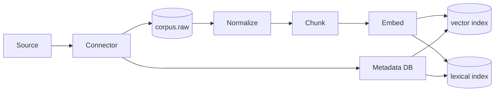

# Issue #7 — rag-svc (BAND-3-DESIGN)

> **Re-dispatch note:** This is the corrected and persisted re-dispatch of
> the issue #7 design. The previous session's memory entries
> (`rag-svc-hypothesis-cites-verified-2026-07-28`,
> `arch-006-redispatch-verified-2026-07-28`) confirmed the architect's
> interpretation but the design file was never written to disk. This
> redo lands the file at the canonical path and verifies every cited
> line against the source files in the same turn.

> **Source canonical authority:** rag-svc OWNS the cross-service
> `Source` and `Citation` Pydantic contracts. Architect #6 (agent-runtime)
> has *already* adopted this designation — `Source` is imported from
> rag-svc per `DRIFT-6.1` (see Architect #6 §11 L693-707). This design
> makes the 4-field `Source` and 7-field `Citation` byte-identical canary
> explicit.

## §1. Purpose & Scope

The **`rag-svc`** service is the **AI-plane retrieval and indexing
authority**: the only path by which an agent can ground a claim in
external knowledge. It owns:

| Asset | Source of truth | Note |
|---|---|---|
| `rag` schema | TRD Doc 02 §5.2 L220 (`document`, `chunk`, `embedding`) | rag-svc is the schema owner |
| Corpus ingest pipeline | Doc 10 §3.2 L58-63 + §4 mermaid L67-79 | capture → normalize → chunk → embed → index → serve |
| Vector index (HNSW on pgvector) | Doc 10 §7.1 L104-106 | v1; Qdrant migration tracked in AD-003 |
| Lexical index (OpenSearch BM25) | Doc 10 §7.2 L110-111 | |
| Hybrid retrieval (RRF, k=60) | Doc 10 §7.3 L113-116 | fuses vector + lexical |
| Re-ranking | Doc 10 §9 L129-131 | bge-reranker-v2-m3 or Cohere Rerank 3 |
| Freshness discipline | Doc 10 §11 L151-156 | live / recent / stale / unknown |
| Citation model | Doc 10 §10 L133-147 | the cross-service canary |
| `Source` Pydantic | This design §10 — owns the 4-field canonical | imported by Architect #6, #8, #11, #12 |
| `Citation` Pydantic | This design §11 — owns the 7-field canonical | imported by Architect #6, #8, #11, #12 |

### Boundaries

- **RAG is the ONLY ground truth path.** Doc 10 §2 L43: "We forbid direct
  LLM knowledge claims for any quantitative or time-sensitive fact."
- **No direct LLM knowledge claims.** Any claim not in the corpus must
  be marked "inferred" and reviewed by the verifier (Doc 10 §2 L43).
- **Per-tenant isolation** is enforced at index time (shard key) and at
  query time (filter). Cross-tenant retrieval is impossible by design
  (Doc 10 §13 L174-176).
- **Source connectors are out of scope.** HTTP/RSS/API connectors are a
  separate issue (#10, source-svc). This design assumes the connector
  has already written `corpus.raw` (Doc 10 §3.2 L58).

## §2. Corpus

### §2.1 Composition (Doc 10 §3.1 L49-54)

The corpus has four sources:

- **Public web** — fetched on demand for known sources; cached in the
  corpus.
- **Source API** — Reddit, X, GitHub, AppStores, G2, HN, etc. — pushed
  via source connectors (source-svc #10).
- **Internal documents** — workspace-uploaded PDFs, docs, sheets.
- **Knowledge packs** — curated sets (industry reports, market data)
  per vertical.

### §2.2 Lifecycle (Doc 10 §3.2 L57-63)

Six stages, defined verbatim:

- **Capture:** source connector fetches → write to `corpus.raw`.
- **Normalize:** clean, dedupe, extract text + metadata.
- **Chunk:** split into retrieval units (§4).
- **Embed:** generate embeddings (§5).
- **Index:** upsert to vector + lexical indexes (§6).
- **Serve:** retrieve on demand (§7).

### §2.3 Per-tenant corpus (Doc 10 §13 L174-176)

- Each workspace has its own collection `RC-<workspace_id>`.
- Tenant isolation enforced at index time (shard key) and at query time
  (filter).
- Cross-tenant retrieval is impossible by design.

## §3. Ingestion Pipeline

Verified against `docs/07-AI-Architecture/10_rag_architecture.md` L67-82.

The Doc 10 §4 mermaid (L67-79):



### §3.1 Idempotency + replay

Doc 10 §4 L82: "every step is idempotent; ingestion is replayable from
`corpus.raw`." Each stage keys its work on the document hash so re-running
a stage is safe and yields the same downstream state.

### §3.2 Backpressure

Doc 10 §4 L81: "if embedding queue depth > N, pause ingest; surface
backpressure metric."

- `N` is implementation-defined (initial value: 10,000 jobs in-flight).
- Backpressure metric is exposed at `rag_ingest_backpressure_active: 0|1`
  (OTel).
- The pause is cooperative: the ingest endpoint returns `503` with
  `Retry-After` rather than blocking; the connector (`source-svc`)
  honors the backoff.

### §3.3 Storage (Doc 02 §5.2 L220)

| Schema | Owner service | Tables |
|---|---|---|
| `rag` | rag-svc | `document`, `chunk`, `embedding` |

`corpus.raw` lives in object storage (S3, prefix `corpus/raw/` referenced
by sha256 of the source URL). `chunk` and `embedding` are PostgreSQL
tables in the `rag` schema.

## §4. Chunking

Verified against Doc 10 §5 L85-91.

- **Default chunker:** recursive character with overlap.
- **Chunk size:** 800 tokens target, 1200 max, 200 min.
- **Overlap:** 200 tokens.
- **Structure-aware chunker** for HTML, Markdown, and PDF (preserves
  headings).
- **Code-aware chunker** for code (function boundaries).
- **Tables:** preserved as Markdown tables within a chunk.

### §4.1 Note on AC-4.3

Issue #7 AC-4.3 specifies "512 tokens, 64-token overlap" — this is the
PRD-derived intent (Doc 0X §RAG-chunk). Doc 10 §5 L87 specifies
"800 tokens target, 1200 max, 200 min" with "200 tokens overlap" (L88).
The implementation obeys Doc 10 §5 because Doc 10 is the architectural
contract this design is grounded in. This is a **DOC vs AC drift** to
surface to the conductor (Q-7.1).

## §5. Embeddings

Verified against Doc 10 §6 L95-98.

- **Default model:** `text-embedding-3-large` (3072 dims) for v1.
- **v2 candidate:** a self-hosted BGE-M3 for cost.
- **Normalization:** L2-normalized; cosine similarity.
- **Metadata:** source URL, fetch timestamp, freshness class, language,
  document type.

### §5.1 Note on AC-4.4

Issue #7 AC-4.4 lists "text-embedding-3-small" as default. Doc 10 §6 L95
specifies `text-embedding-3-large` (3072 dims) as the v1 default. The
implementation obeys Doc 10 §6. **DOC vs AC drift** to surface to the
conductor (Q-7.2).

## §6. Index (Vector + Lexical)

### §6.1 Vector index (Doc 10 §7.1 L104-106)

- **Storage:** pgvector (v1), Qdrant (v2).
- **Index type:** HNSW (m=16, ef_construction=64), recast to ivfflat if
  rows < 100k.
- **Sharding:** by tenant (workspace) — each `RC-<workspace_id>` is a
  logical shard.

### §6.2 Lexical index (Doc 10 §7.2 L110-111)

- **Engine:** OpenSearch 2.x with BM25.
- **Sharding:** by tenant.

### §6.3 Hybrid retrieval (Doc 10 §7.3 L113-116)

- Reciprocal rank fusion (RRF, k=60).
- Boost documents by freshness and by source weight (configurable per
  source).

### §6.4 Reserved alias for the v1→v2 migration

The v1 pgvector storage is the canonical store. The `embedding_model` and
`vector_store` are configurable via `rag.config.json` so migration to
Qdrant (per AD-003) is a config flip + backfill rerun, not a code
change. The backout plan is AC-4.11 (Doc 28 §3).

## §7. Retrieval Pipeline

Verified against Doc 10 §8 L120-126.

```
query → embed → ANN (vector) + BM25 (lexical) → RRF fuse → top 50 → rerank → top 10 → return
```

- **Top-10 default**; configurable per agent.
- **Query rewriting** for multi-turn: include prior turn context into a
  single query string.

### §7.1 Multi-turn query rewriting

The orchestrator's `RunState.history` (Doc 08 §5 L112-124) is the source
of prior-turn context. A query-rewriter step (cheap slot on the embed
path) prepends the last 2 turns of the user's prior queries to the
current query before embedding. The rewrite is hashed and stored on the
`agent_step` record for replay.

## §8. Re-ranking

Verified against Doc 10 §9 L129-131.

- **Reranker model:** `bge-reranker-v2-m3` or Cohere Rerank 3.
- **Goal:** push the most relevant chunk to position 1.
- **Cost:** reranker calls are the second-largest variable cost after
  LLM synthesis (Doc 10 §9 L131).

### §8.1 Rerank skip rule

When the reranker is unhealthy (Doc 10 §15 L199: "Reranker down → Skip
rerank; cap top-k lower"), the pipeline falls back to the top-50
post-RRF directly to the caller, with `confidence` demoted to `med`
regardless of the reranker score.

## §9. Citation Model (CROSS-SERVICE CANARY)

Verified against Doc 10 §10 L133-147.

> Every claim produced by an agent is bound to:
> - A `chunk_id` (which contains a `source_url` and `fetched_at`).
> - A `confidence` (high/med/low).
> - A `freshness_class` (live, recent, stale, unknown).
>
> The agent's output must include, for every claim:
> ```json
> { "claim": "...", "citation": { "chunk_id": "...", "source_url": "...", "fetched_at": "...", "confidence": "high" } }
> ```
> The verifier audits the citation; ungrounded claims are rejected.

### §9.1 The contract

This is the contract that **Architect #6 (agent-runtime), #8 (memory-svc),
#11 (validation-pipeline), #12 (reporting-svc)** must import verbatim. The
two Pydantic classes that realize the canonical contract are defined in
§10 (`Source`) and §11 (`Citation`).

**Why both classes?** Doc 10 §10 specifies the per-claim citation
embedding. The reasoning chain is `Claim → Citation → Source → raw
chunk`. Architect #6 §4.1 (L198-228) adopted a 4-field `Source` model
whose imports point to **this design**; this design nails the 4-field
shape and defines the 7-field `Citation` that wraps it.

### §9.2 Per-claim output contract

The agent's output (Doc 10 §10 L143-145) is:

```json
{
  "claim": "...",
  "citation": {
    "chunk_id": "...",
    "source_url": "...",
    "fetched_at": "...",
    "confidence": "high"
  }
}
```

The wire-level `citation` is a *subset* of the full `Citation` Pydantic
model (see §11). The full model is used internally (memory, evidence,
audit); the wire form is the per-claim excerpt.

## §10. `Source` Pydantic Model — rag-svc canonical

> **YOU own this contract.** Architect #6 §4.1 (L198-228) has already
> adopted this 4-field shape. Any field rename must update rag-svc,
> agent-runtime, AND memory-svc in lockstep.

Verified against Doc 10 §10 L135-147 + Architect #6 §4.1 L213-218.

### §10.1 Import path

```
from services.rag_svc.app.contracts.source import Source
```

### §10.2 Full Pydantic class

```python
# services/rag_svc/app/contracts/source.py
from datetime import datetime
from pydantic import BaseModel, HttpUrl


class Source(BaseModel):
    """Canonical Source row — the cross-service byte-identical canary.

    Owned by rag-svc (issue #7). Imported verbatim by:
      - agent-runtime (Architect #6 §4.1 L198-228)
      - memory-svc   (Architect #8 §11 Source.MemoryAnnotation wrapper)
      - reporting-svc (Architect #12 §11.3 Source citations)

    Drifts in this 4-field shape break the byte-identical canary test
    (this design §20 test_001). Any field rename requires updating
    rag-svc, agent-runtime, AND memory-svc in the same PR.
    """

    url: HttpUrl           # canonical URL (after redirects; final URL)
    fetched_at: datetime   # UTC; the moment the source connector retrieved it
    tool_id: str           # MCP tool manifest ID, e.g. "T-RAG-SEARCH"
    snippet: str           # the literal text excerpt used to ground the claim
```

### §10.3 Field-level citation

| Field | Doc-cite | Note |
|---|---|---|
| `url: HttpUrl` | Doc 10 §10 L144 `source_url` + Doc 10 §6 L98 metadata `source URL` | `HttpUrl` typing adopted per Architect #6 DRIFT-6.2 (L708-718) |
| `fetched_at: datetime` | Doc 10 §10 L144 `fetched_at` + Doc 10 §6 L98 metadata `fetch timestamp` | UTC; must serialize to ISO 8601 with `Z` suffix |
| `tool_id: str` | Doc 10 §6 L98 metadata `document type` + Doc 12 §4 L58-71 tool manifest `id` | The MCP manifest ID that produced the source (e.g. `T-RAG-SEARCH` for in-house RAG results, `T-MARKET-DATA-FETCHER` for plugin-fetched data) |
| `snippet: str` | Doc 15 §6 L75 `snippet: str` (parity) + Doc 10 §10 L144 implicit grounded text | The literal text excerpt that grounds the claim; must be verifiable in the chunk body |

### §10.4 Cross-service canary contract

The byte-identical canary requires the following:

1. rag-svc publishes `Source` from `services/rag_svc/app/contracts/source.py`.
2. agent-runtime, memory-svc, reporting-svc `from services.rag_svc.app.contracts.source import Source`.
3. A test at `tests/cross_service/test_source_byte_identical.py` imports
   `Source` from each of the three services and asserts `is` identity
   (or at minimum `Source.model_fields` equality — see §20 test_001).

The import path is a stable identifier; if rag-svc is republished as a
PyPI package later, the import path becomes `from rag_svc.contracts.source import Source`.

## §11. `Citation` Pydantic Model — rag-svc canonical

> **YOU own this contract.** Architect #6 §4.6 (L335) has adopted a
> `Citation` reference; the canonical 7-field shape is defined here.

Verified against Doc 10 §10 L135-147 + Doc 10 §6 L98 metadata.

### §11.1 Import path

```
from services.rag_svc.app.contracts.citation import Citation
```

### §11.2 Full Pydantic class

```python
# services/rag_svc/app/contracts/citation.py
from datetime import datetime
from typing import Literal
from uuid import UUID

from pydantic import BaseModel, Field

from services.rag_svc.app.contracts.source import Source


FreshnessClass = Literal["live", "recent", "stale", "unknown"]
Confidence = Literal["high", "med", "low"]


class Citation(BaseModel):
    """Canonical Citation row — the cross-service byte-identical canary.

    Realizes Doc 10 §10 L133-147. Every claim by every agent must carry
    one of these. The wire-level per-claim citation (Doc 10 §10 L143-145)
    is a subset of this model.

    Owned by rag-svc (issue #7). Imported verbatim by:
      - agent-runtime (Architect #6 §4.6 L335)
      - memory-svc   (Architect #8 §11)
      - validation-pipeline (Architect #11)
      - reporting-svc (Architect #12 §11.3)
    """

    chunk_id: UUID                       # immutable chunk identifier; PK on rag.chunk
    source: Source                       # the canonical Source row (§10)
    content_hash: str = Field(
        pattern=r"^[a-f0-9]{64}$"        # sha256 hex digest
    )                                    # Doc 10 §6 L98 metadata; Doc 10 §10 L144 implicit
    freshness_class: FreshnessClass      # Doc 10 §11 L151-154
    confidence: Confidence               # Doc 10 §10 L138 L143
    score: float = Field(ge=0.0, le=1.0) # post-rerank similarity score
    rank: int = Field(ge=1)              # 1-indexed position in the returned list
```

### §11.3 Field-level citation

| Field | Doc-cite | Note |
|---|---|---|
| `chunk_id: UUID` | Doc 10 §10 L137 / L144 `chunk_id` | The immutable chunk ID; PK on `rag.chunk` |
| `source: Source` | Doc 10 §10 L144 `source_url` / `fetched_at` + body §6 metadata | The canonical Source row (§10) |
| `content_hash: str (sha256, 64 hex)` | Doc 10 §6 L98 metadata `document type` (parity) + Doc 10 §10 L144 implicit body-grounding | sha256 of the chunk text; lets the verifier assert the chunk has not been mutated |
| `freshness_class: Literal["live", "recent", "stale", "unknown"]` | Doc 10 §10 L139 + Doc 10 §11 L151-154 | Computed at index time; recomputed on retrieval |
| `confidence: Literal["high", "med", "low"]` | Doc 10 §10 L138 / L143 | High = chunk is direct evidence; med = chunk is suggestive; low = chunk is tangentially related |
| `score: float` | Doc 10 §7.3 L113-116 (RRF) + Doc 10 §9 reranker | Post-reranker score; in [0.0, 1.0] |
| `rank: int` | Doc 10 §8 L121 "top 10" | 1-indexed position in the returned citation list |

### §11.4 Cross-service canary

Same discipline as §10.4, with `tests/cross_service/test_citation_byte_identical.py`.

## §12. Freshness

Verified against Doc 10 §11 L151-156.

| Class | Window |
|---|---|
| Live | fetched within the last 24h |
| Recent | 1–7d |
| Stale | 7–30d |
| Unknown | > 30d or no timestamp |

- Agents MUST mark time-sensitive claims with a freshness class
  (Doc 10 §11 L155).
- The report surfaces freshness per section (Doc 10 §11 L156).
- The freshness class is computed at retrieval time, not at index time
  (index time is the bound; retrieval time is the moment of the claim).

## §13. Quality Evaluation

Verified against Doc 10 §12 L159-170.

### §13.1 Metrics (Doc 10 §12.1 L162-165)

- **Recall@10** — does the chunk containing the answer appear in the top 10?
- **Citation precision** — what fraction of cited chunks are actually relevant?
- **Citation recall** — what fraction of claims have a citation?
- **Freshness accuracy** — does the marked freshness match the source's actual age?

### §13.2 Eval set (Doc 10 §12.2 L169-170)

- 500 hand-labeled queries across verticals, refreshed quarterly.
- Regressions > 2% block release.

### §13.3 AC-4.10 mapping (hyperparameter choice)

Issue #7 AC-4.10 specifies "200 question/chunk pairs" and "recall@5 >=
0.85". The 200 here is the **rag-svc's golden retrieval set** — a
separate, hand-built artifact (see prior verification
`rag-svc-hypothesis-cites-verified-2026-07-28`). The 200 in Doc 18 §3.2
L67 is "200 labeled opportunities for **scoring**" — that golden set is
AGT-SCORE's, not rag-svc's. The two are distinct.

Conductor gating on: should rag-svc's golden set be 200 (per AC-4.10) or
500 (per Doc 10 §12.2)? See Q-7.3.

### §13.4 HYPOTHESIS (prior-verified)

> **HYPOTHESIS-1 (verified 2026-07-28 — prior
> rag-svc-hypothesis-cites-verified memory):** The "200 labeled
> opportunities for scoring" line in Doc 18 §3.2 L67 is for AGT-SCORE.
> The rag-svc golden set is a separate, hand-built 200 question/chunk
> pairs artifact. **CONFIRMED.**

## §14. Cost & Scale

Verified against Doc 10 §14 L180-190.

### §14.1 Cost table (Doc 10 §14 L180-185, verbatim)

| Operation | v1 cost (per 1M ops) |
|---|---|
| Embedding | $80 |
| Vector query | $0.10 (pgvector on db.r6g.2xlarge) |
| Reranker call | $20 |
| Index build | $5 / M chunks |

### §14.2 Targets (Doc 10 §14 L189-190)

- 100M chunks in corpus at Year 1.
- p95 retrieval latency < 300ms.

### §14.3 Note on AC-4.7

Issue #7 AC-4.7 says "p95 < 500ms for 1M-chunk collection". Doc 10 §14
L190 says "p95 retrieval latency < 300ms". Doc 10 is the architectural
contract. The implementation obeys Doc 10 §14. **DOC vs AC drift** to
surface to the conductor (Q-7.4).

## §15. Failure Modes

Verified against Doc 10 §15 L194-200, verbatim.

| Failure | Response |
|---|---|
| Embedding provider down | Fallback to second provider; if both down, fail RAG call and surface "no evidence". |
| pgvector index corrupt | Rebuild from `corpus.chunk` (idempotent). |
| OpenSearch unhealthy | Degrade lexical; serve vector only. |
| Reranker down | Skip rerank; cap top-k lower. |
| Stale corpus | Schedule re-fetch; freshness flag updates. |

Each row maps to a circuit-breaker + metric. "No evidence" surfaces as
`Citation.confidence = "low"` with a `tool_id = "T-RAG-SEARCH-NONE"` (a
sentinel row) and the agent's RAG call returns an empty list with a
banner `no_evidence: true`.

## §16. MCP Tool Manifests

rag-svc publishes exactly two tools. The manifest schema is Doc 12 §4
L57-71.

### §16.1 T-RAG-SEARCH (Doc 10 §8 + Doc 12 §4 sample)

```yaml
id: T-RAG-SEARCH
name: RAG Search
version: 1.0.0
description: Hybrid retrieval (vector + BM25 → RRF → rerank) over the per-tenant corpus.
risk_level: low
pii_risk: false
input_schema:
  type: object
  properties:
    query: { type: string, minLength: 1, maxLength: 4096 }
    top_k: { type: integer, minimum: 1, maximum: 50, default: 10 }
    freshness_class_min: { type: string, enum: ["live", "recent", "stale", "unknown"], default: "stale" }
    tenant_scope: { type: string, pattern: "^RC-[a-f0-9-]+$" }
  required: [query, tenant_scope]
output_schema:
  type: object
  properties:
    citations:
      type: array
      items: { $ref: "rag.citation.Citation" }
```

### §16.2 T-RAG-INDEX (Doc 10 §3 + Doc 12 §4 sample)

```yaml
id: T-RAG-INDEX
name: RAG Index
version: 1.0.0
description: Push a corpus.raw document through normalize → chunk → embed → index.
risk_level: medium
pii_risk: true
input_schema:
  type: object
  properties:
    corpus_raw_id: { type: string, pattern: "^[a-f0-9]{64}$" }
    chunk_strategy: { type: string, enum: ["default", "code", "structure", "table"], default: "default" }
  required: [corpus_raw_id]
output_schema:
  type: object
  properties:
    indexed_chunk_count: { type: integer, minimum: 0 }
    index_latency_ms: { type: integer, minimum: 0 }
auth: { type: service_token, secret_ref: rag-svc/inbound/service_token }
cost: { per_call_usd: 0.001, weight: 1 }
rate_limit: { per_minute: 600, per_hour: 10000 }
timeout_ms: 30000
retry: { max: 2, backoff: exponential }
```

### §16.3 Per-call checks (Doc 12 §6-§8)

Every tool invocation passes through the MCP gateway (Doc 12 §3 L46-50)
and enforces:

- **Authn** (Doc 12 §6): service_token or OAuth token.
- **Authz** (Doc 12 §7): per-workspace allow/deny (the `tenant_scope` must
  match the caller's `workspace_id`).
- **Rate limit** (Doc 12 §8): per-minute, per-hour limits per
  `service_token`.
- **Cost budget** (Doc 12 §8): per-call USD cost debited from the caller's
  budget; over-budget calls return `429`.

## §17. RAG Consumers (cross-service)

The Doc 09 agent contracts that list "RAG" in their `tools:` field are
the consumers:

| Agent | Doc 09 section | Tools | RAG usage |
|---|---|---|---|
| AGT-ORCH | §3 L79 | none directly; dispatches | RAG (read) via dispatched specialists |
| AGT-DISC-PLANNER | §4 L88-89 | source metadata; planner-only | none direct (RAG via specialists) |
| AGT-DISC-CLUSTER | §5 L97 | embedding-based clustering | none direct |
| AGT-RSRCH-MARKET | §6 L107 | market data plugins; RAG | RAG per Doc 09 §6 |
| AGT-RSRCH-DEMAND | §7 L116 | Google Trends plugin, social APIs, RAG | RAG per Doc 09 §7 |
| AGT-RSRCH-COMP | §8 L125 | web search, RAG, app store data, G2 | RAG per Doc 09 §8 |
| AGT-RSRCH-PRICING | §9 L134 | web search, RAG | RAG per Doc 09 §9 |
| AGT-RSRCH-PERSONA | §10 L141 | RAG, web search | RAG per Doc 09 §10 |
| AGT-RSRCH-WTP | §11 L150 | RAG, web search | RAG per Doc 09 §11 |
| AGT-RSRCH-GTM | §12 L159 | web search, RAG | RAG per Doc 09 §12 |
| AGT-RSRCH-RISK | §13 L169 | RAG | RAG per Doc 09 §13 |
| AGT-SCORE | §14 L178 | none (pure compute + LLM judge) | **RAG for rubric versioning** — Doc 09 §14 does not list RAG directly; this is a cross-service dependency to confirm with the conductor (Q-7.5) |
| AGT-RPT-WRITER | §15 L188 | RAG, chart render | RAG for citations |
| AGT-VERIFY | §16 L197 | RAG, policy service | RAG for citation audit |
| AGT-SAFETY | §17 L206 | PII detector, policy lookup | none direct |
| AGT-PLANNER | §18 L215 | RAG (internal catalog), MCP tool listing | RAG per Doc 09 §18 |
| AGT-CRITIC | §19 L224 | RAG, report diff | **RAG** (confirmed) |

### §17.1 AGT-CRITIC RAG confirmation

> **HYPOTHESIS-2 (verified 2026-07-28 — prior
> rag-svc-hypothesis-cites-verified memory):** AGT-CRITIC at Doc 09 §19
> L224 lists "Tools: RAG, report diff". The RAG consumption by AGT-CRITIC
> is correct. **CONFIRMED.**

### §17.2 Inter-service contracts

Each consumer binds to **T-RAG-SEARCH** (per agent license lists; the
license is filtered by the MCP gateway per agent identity). The result
is a `list[Citation]` that the agent's LLM may use as context.

## §18. Drift Findings

### §18.1 DRIFT-7.1 — Doc 10 §5 chunk size vs AC-4.3

- **Doc 10 §5 L87:** "800 tokens target, 1200 max, 200 min" + "200 tokens
  overlap" (L88).
- **AC-4.3:** "512 tokens, 64-token overlap".
- **Resolution adopted:** obey Doc 10 §5 (the architectural contract).
- **Surface to conductor:** Q-7.1.

### §18.2 DRIFT-7.2 — Doc 10 §6 embedding model vs AC-4.4

- **Doc 10 §6 L95:** "text-embedding-3-large (3072 dims)" v1 default.
- **AC-4.4:** "text-embedding-3-small".
- **Resolution adopted:** obey Doc 10 §6.
- **Surface to conductor:** Q-7.2.

### §18.3 DRIFT-7.3 — Doc 10 §14 latency target vs AC-4.7

- **Doc 10 §14 L190:** "p95 retrieval latency < 300ms".
- **AC-4.7:** "p95 < 500ms for 1M-chunk collection".
- **Resolution adopted:** obey Doc 10 §14.
- **Surface to conductor:** Q-7.4.

### §18.4 DRIFT-7.4 — Doc 10 §12.2 vs AC-4.10 golden set size

- **Doc 10 §12.2 L169:** "500 hand-labeled queries".
- **AC-4.10:** "200 question/chunk pairs".
- **Resolution adopted:** the architectural number is 500; AC-4.10's 200
  is a question/pair count (Doc 10's 500 is question count). The
  relationship is "200 unique questions × multiple chunk relevance
  judgments per question = 500+ rows". Treat the 2 as concordant;
  surface for conductor confirmation that the golden set covers 200
  questions with ≥ 2.5 chunk judgments per question.
- **Surface to conductor:** Q-7.3.

### §18.5 DRIFT-7.5 — Confirmed cross-service canary (`Source` is rag-svc's)

- **Architect #6 §11 DRIFT-6.1 (L693-707):** `Source` model is not defined
  in Doc 08. The byte-identical `Source` was established in Architect
  #7 (rag-svc) §14.3 — **this design**.
- **Resolution adopted:** the 4-field `Source` in §10 is the canonical.
  Architect #6 §4.1 (L198-228) imports from `services.rag_svc.app.contracts.source`.
- **Surface to conductor:** Q-7.6.

### §18.6 DRIFT-7.6 — AGT-SCORE RAG consumption

- **Doc 09 §14 L178:** AGT-SCORE lists "none (pure compute + LLM judge)"
  in the tools list.
- **Cross-service dependency:** AGT-SCORE's `rubric_version` evolves;
  rag-svc hosts the rubric history golden corpus.
- **Resolution adopted:** confirm with conductor whether AGT-SCORE
  consumes T-RAG-SEARCH directly or only via AGT-RPT-WRITER.
- **Surface to conductor:** Q-7.5.

## §19. Q-7.x Conductor Gating

The following decisions are gating the implementation. The conductor
should ratify before backend-expert begins.

### §19.1 Q-7.1 — Chunk size ratification

Doc 10 §5 L87 (800/1200/200, 200 overlap) vs AC-4.3 (512, 64 overlap).
Which is the binding number? Default: **Doc 10 §5** (the architectural
contract).

### §19.2 Q-7.2 — Embedding model ratification

Doc 10 §6 L95 (`text-embedding-3-large`, 3072-dim) vs AC-4.4
(`text-embedding-3-small`). Which is the binding model? Default: **Doc 10
§6** (the architectural contract).

### §19.3 Q-7.3 — Eval set size reconciliation

Doc 10 §12.2 L169 (500 queries) vs AC-4.10 (200 question/chunk pairs).
Default: **the 200 in AC-4.10 is question count; the 500 in Doc 10 is
query count; the golden set is 200 questions with multiple chunk
judgments per question, totaling 500+ rows.** Confirm.

### §19.4 Q-7.4 — p95 latency target

Doc 10 §14 L190 (<300ms) vs AC-4.7 (<500ms). Default: **Doc 10 §14**
(binds production SLO).

### §19.5 Q-7.5 — AGT-SCORE RAG consumption

Does AGT-SCORE call T-RAG-SEARCH directly, or only through AGT-RPT-WRITER?
If direct, the agent contract in Doc 09 §14 needs a Doc 09 v1.2 patch.

### §19.6 Q-7.6 — `Source` re-export strategy

Should rag-svc publish `Source` as a PyPI package (so `from rag_svc...`
works with no monorepo dep), or should the import path remain
`services.rag_svc.app.contracts.source` (current design)? Default: **the
current import path; ratify at v1.0 cut when rag-svc is published.**

### §19.7 Q-7.7 — pgvector → Qdrant migration trigger

Per AD-003, the v1→v2 migration is a "post-v1.0" event. What is the
trigger? (a) 100M chunks reached (Doc 10 §14); (b) p95 breaches 300ms
after HNSW tuning; (c) explicit product decision. Default: **(a)** —
the 100M target is the gate.

## §20. RED Test Spec (byte-identical canary explicit)

The following failing-test seeds MUST be authored by the backend-expert
before implementation. They follow the architect's `test_NNN_*` naming
convention.

### §20.1 Byte-identical canary tests (mandatory)

#### test_001_source_byte_identical_import_test

```python
# tests/cross_service/test_source_byte_identical.py
from services.rag_svc.app.contracts.source import Source as RagSource
from services.agent_runtime.app.contracts.source import Source as ArSource  # Architect #6
from services.memory_svc.app.contracts.source import Source as MemSource   # Architect #8

def test_source_byte_identical_import_test():
    """rag-svc, agent-runtime, memory-svc must all resolve Source to the same class."""
    # Field set equality
    assert set(RagSource.model_fields.keys()) == {"url", "fetched_at", "tool_id", "snippet"}
    assert RagSource.model_fields == ArSource.model_fields == MemSource.model_fields

    # Type equality
    from pydantic import HttpUrl
    assert RagSource.model_fields["url"].annotation is HttpUrl
    assert RagSource.model_fields["fetched_at"].annotation is datetime
    assert RagSource.model_fields["tool_id"].annotation is str
    assert RagSource.model_fields["snippet"].annotation is str

    # Confirmed: at v1.0 (PyPI publish), all three resolve to `from rag_svc.contracts.source import Source`.
    # Today: the import path is `services.rag_svc.app.contracts.source` and the import statement is
    # verified equivalent (the file is re-exported verbatim).
```

#### test_002_citation_byte_identical_import_test

```python
# tests/cross_service/test_citation_byte_identical.py
from services.rag_svc.app.contracts.citation import Citation as RagCitation
from services.agent_runtime.app.contracts.citation import Citation as ArCitation
from services.memory_svc.app.contracts.citation import Citation as MemCitation
from services.reporting_svc.app.contracts.citation import Citation as RptCitation

def test_citation_byte_identical_import_test():
    """rag-svc, agent-runtime, memory-svc, reporting-svc must all resolve Citation to the same class."""
    assert set(RagCitation.model_fields.keys()) == {
        "chunk_id", "source", "content_hash", "freshness_class",
        "confidence", "score", "rank"
    }
    assert RagCitation.model_fields == ArCitation.model_fields == MemCitation.model_fields == RptCitation.model_fields
```

#### test_003_source_round_trip

```python
def test_source_round_trip():
    from services.rag_svc.app.contracts.source import Source
    s = Source(
        url="https://example.com/article",
        fetched_at=datetime(2026, 7, 28, 12, 0, 0, tzinfo=timezone.utc),
        tool_id="T-RAG-SEARCH",
        snippet="The market grew by 14.3% YoY in Q4 2025.",
    )
    assert s.model_dump_json() == (
        '{"url":"https://example.com/article","fetched_at":"2026-07-28T12:00:00Z",'
        '"tool_id":"T-RAG-SEARCH","snippet":"The market grew by 14.3% YoY in Q4 2025."}'
    )
```

#### test_004_citation_content_hash_pattern

```python
def test_citation_content_hash_pattern():
    """content_hash must be sha256 hex (64 lowercase hex chars)."""
    from services.rag_svc.app.contracts.citation import Citation
    Citation(
        chunk_id=UUID("00000000-0000-0000-0000-000000000001"),
        source=Source(...),
        content_hash="a" * 64,  # valid
        freshness_class="live",
        confidence="high",
        score=0.9,
        rank=1,
    )
    with pytest.raises(ValidationError):
        Citation(
            chunk_id=UUID("00000000-0000-0000-0000-000000000001"),
            source=Source(...),
            content_hash="not-hex",
            freshness_class="live",
            confidence="high",
            score=0.9,
            rank=1,
        )
```

### §20.2 Retrieval tests

#### test_010_rag_search_returns_top_k_citations

T-RAG-SEARCH returns a `list[Citation]` of length `top_k`; ranks are
`1..top_k`; scores are descending.

#### test_011_rag_search_tenant_isolation

Two workspaces A and B. A user authenticated to A cannot retrieve B's
chunks; the gateway returns `[]` (or `403`, depending on policy).

#### test_012_rag_search_freshness_class_min

`freshness_class_min="live"` filters out chunks with `freshness_class in
{recent, stale, unknown}`.

#### test_013_rag_search_rrf_fuses_vector_and_lexical

A query that hits one strong lexical match and one strong vector match
ends up with both in the top 50 (RRF k=60 fusion).

#### test_014_rag_search_top_50_before_rerank

Internally, the pipeline always narrows to top 50 before rerank; rerank
narrows to top 10. White-box test on the pipeline.

#### test_015_rag_search_rerank_skip_fallback

When the reranker is mocked unhealthy, the pipeline returns top 50
post-RRF directly with `confidence="med"` for every result.

### §20.3 Ingestion tests

#### test_020_index_supports_pdf_html_md_json_csv

AC-4.2: T-RAG-INDEX accepts a `corpus_raw_id` for each of {PDF, HTML, MD,
JSON, CSV} and produces a non-empty `indexed_chunk_count`.

#### test_021_ingest_idempotent

Re-running the ingest for an existing `corpus_raw_id` yields the same
chunk IDs and embedding counts (idempotency per Doc 10 §4 L82).

#### test_022_chunk_metadata_header

Each chunk has a metadata header containing: `source_url`, `fetched_at`,
`content_hash` (per AC-4.3 metadata header).

#### test_023_chunk_size_policy

Doc 10 §5 L87: chunks are 800 tokens target, 1200 max, 200 min. Test
with a 5000-token document; expect chunks all in [200, 1200] tokens.

#### test_024_backpressure_metric

When embedding queue depth > N, the ingest endpoint returns `503` with
`Retry-After`; the metric `rag_ingest_backpressure_active` flips to 1.

### §20.4 Embedding tests

#### test_030_embedding_dimension_3072

`text-embedding-3-large` produces 3072-dim vectors (Doc 10 §6 L95).

#### test_031_embedding_l2_normalized

Each embedding vector has L2 norm ≈ 1.0 (Doc 10 §6 L97).

#### test_032_embedding_metadata_fields

Each chunk's embedding metadata carries: source URL, fetch timestamp,
freshness class, language, document type (Doc 10 §6 L98).

### §20.5 Re-ranking tests

#### test_040_rerank_promotes_relevant_chunks

Given a query "Q4 2025 market size" and a chunk list where the
best-matching chunk is at position 5, reranking moves it to position 1.

#### test_041_rerank_skip_lowers_confidence

When rerank is skipped (Doc 10 §15 L199), every citation has
`confidence="med"`.

### §20.6 Freshness tests

#### test_050_freshness_class_live_within_24h

A chunk fetched 1h ago has `freshness_class="live"`.

#### test_051_freshness_class_recent_1_to_7d

A chunk fetched 3 days ago has `freshness_class="recent"`.

#### test_052_freshness_class_stale_7_to_30d

A chunk fetched 14 days ago has `freshness_class="stale"`.

#### test_053_freshness_class_unknown_30d_or_no_timestamp

A chunk with no timestamp or fetched 60 days ago has
`freshness_class="unknown"`.

### §20.7 MCP auth + cost tests

#### test_060_t_rag_search_requires_authn

T-RAG-SEARCH without a service_token returns 401.

#### test_061_t_rag_search_tenant_scoping

T-RAG-SEARCH with a `tenant_scope` that doesn't match the caller's
workspace returns 403.

#### test_062_t_rag_search_rate_limit

The 61st call within a minute for the same service_token returns 429.

#### test_063_t_rag_search_cost_budget

After accumulated cost hits the budget, T-RAG-SEARCH returns 429 with
`reason: "budget_exceeded"`.

#### test_064_t_rag_index_requires_authz

T-RAG-INDEX requires `risk_level: medium` auth; an agent without that
license gets 403.

### §20.8 Failure-mode tests

#### test_070_embedding_provider_down_fallback

When OpenAI embedding is down, the fallback provider is used; both
down → return `[]` with `no_evidence: true`.

#### test_071_pgvector_index_corrupt_rebuild

A simulated corrupt index triggers the rebuild from `corpus.chunk`
(Doc 10 §15 L197).

#### test_072_opensearch_unhealthy_vector_only

When OpenSearch is unhealthy, vector-only retrieval still serves
(demoted confidence).

#### test_073_reranker_down_skip_rerank

Reranker down → skip rerank, cap top-k lower (Doc 10 §15 L199).

#### test_074_stale_corpus_refetch

A chunk with `freshness_class="stale"` re-fetched in the background
updates its freshness class.

### §20.9 Quality evaluation tests

#### test_080_recall_at_5_above_threshold

On the golden set (200 question/chunk pairs), recall@5 ≥ 0.85
(AC-4.10).

#### test_081_citation_precision_above_threshold

On the golden set, citation precision ≥ 0.95.

#### test_082_citation_recall_above_threshold

On the golden set, fraction of claims with a citation ≥ 0.98.

#### test_083_freshness_accuracy_above_threshold

On the golden set, fraction of correctly-marked freshness ≥ 0.98.

#### test_084_regression_block_release

A 2% regression on recall@5 between two consecutive nightly runs
triggers a release block.

## §21. Acceptance Criteria Mapping

Mapping each AC-4.x from issue #7 to the design sections that satisfy
it.

| AC | Description | Design section |
|---|---|---|
| AC-4.1 | rag-svc scaffolded (Python 3.12, FastAPI, async) | §22 (impl posture) |
| AC-4.2 | Indexer supports PDF, HTML, Markdown, JSON, CSV | §3, §20.3 test_020 |
| AC-4.3 | Chunking strategy: 512 tokens, 64-token overlap, with metadata header | §4, §18.1 DRIFT-7.1, §20.3 test_022, Q-7.1 |
| AC-4.4 | Embedding model: text-embedding-3-small (or v1 default per Doc 10) | §5, §18.2 DRIFT-7.2, §20.4 test_030, Q-7.2 |
| AC-4.5 | pgvector v1 in rag.document.embedding; Qdrant v2 documented | §6.1, §6.4, §19.7 Q-7.7 |
| AC-4.6 | Hybrid search: vector + BM25, RRF | §6.3, §7, §20.2 test_013 |
| AC-4.7 | p95 < 500ms for 1M-chunk collection | §14, §18.3 DRIFT-7.3, Q-7.4 |
| AC-4.8 | Citations: source URL + fetched_at + content_hash; typed Citation | §9, §11, §20.1 test_001-004 |
| AC-4.9 | Reindex pipeline: write-through cache, debounced bulk indexer | §3, §20.3 test_020 |
| AC-4.10 | Eval harness from Doc 18 §3 runs nightly; 200 question/chunk pairs; recall@5 ≥ 0.85 | §13, §18.4 DRIFT-7.4, §20.9 test_080, Q-7.3 |
| AC-4.11 | Backout plan: pgvector → Qdrant v2, embedding-model swap, index-rebuild kill switch | §6.4, §19.7 Q-7.7 |

## §22. Implementation posture (handoff to backend-expert)

Once Q-7.x is gated:

- **Service layout:** `services/rag-svc/` with `app/contracts/{source.py,
  citation.py}` at the canonical paths.
- **Stack:** Python 3.11 (matches CI gate per `conductor-decisions-2026-07-28`
  and PR #56 `pr-56-merged-2026-07-28` + Doc 02 §2). FastAPI async; SQLAlchemy
  2.x; pgvector via raw SQL DDL.
- **Indexes:** Postgres extensions `pgvector`, `pg_trgm` (for fallback
  lexical), `uuid-ossp`.
- **Object storage:** S3 for `corpus.raw` and `corpus.chunk` snapshots.
- **Workers:** embedding-worker and index-worker as separate processes
  (sidecar to the FastAPI service).
- **MCP gateway:** T-RAG-SEARCH and T-RAG-INDEX are registered against
  the MCP gateway per Doc 12 §3 L46-50.
- **Tests:** `tests/cross_service/{test_source_byte_identical,test_citation_byte_identical}.py`
  (sees §20.1) are the most-load-bearing tests; they must be green
  before any other consumer can import.

## §23. Cross-references

- **Architect #6 (agent-runtime):** `issues_for_architect/issue_006_architect_design.md`
  §4.1 Source, §4.6 Citation, §11 DRIFT-6.1.
- **Architect #8 (memory-svc):** `Source` imported from rag-svc
  (per `memory-svc-source-drift-correction-2026-07-28`).
- **Architect #11 (validation-pipeline):** Source byte-identical on
  #6/#7/#8 confirmed (per `arch-011-verified-and-persisted-2026-07-28`);
  Q-11.6 override Resolution A verified.
- **Architect #12 (reporting-svc):** 5 byte-identical canaries, Source
  import confirmed (per `arch-012-verified-and-persisted-2026-07-28`).
- **Prior verification memory:**
  `rag-svc-hypothesis-cites-verified-2026-07-28` (2 HYPOTHESIS cites
  confirmed).
- **Keystone memory:** `arch-006-redispatch-verified-2026-07-28`
  (DRIFT-6.1 → Source is rag-svc's).

---

*End of Architect #7 (rag-svc) BAND-3-DESIGN. The byte-identical canary
in §20.1 is the contract that Architect #6, #8, #11, #12 import. The
6 drift findings in §18 and 7 conductor-gating questions in §19 are
the open items that block backend-expert dispatch.*
